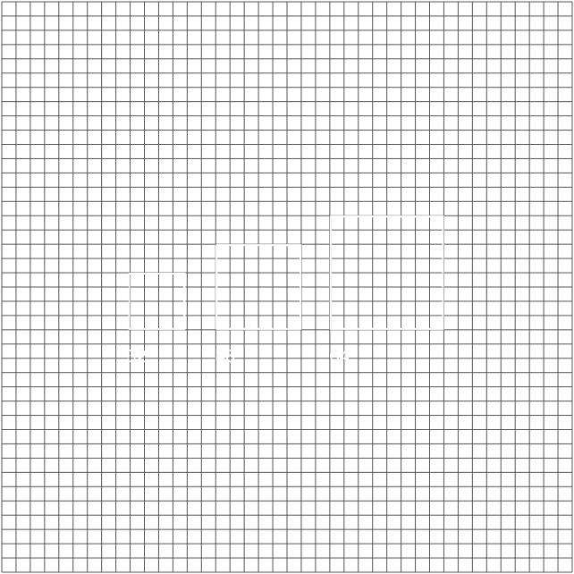

import HomepageTemplate from 'gatsby-theme-carbon/src/templates/Homepage';
import HomepageTile from '../components/HomepageTile';
import Carousel from '../components/Carousel';
import Helmet from '../components/Helmet';

export default HomepageTemplate;

import { noGutterSm } from '../styles/Grid.module.scss';

<Helmet />

<Row classname='homepage-row'>
  <Column colLg={4} colMd={4} noGutterSm>
    <ImageCard
      title="Typeface"
      href="/typography/typeface"
      actionIcon="arrowRight"
      titleColor="light"
      iconColor="light"
      className="card-background"
      >

  </ImageCard>
  </Column>

  <Column colLg={4} colMd={4} noGutterSm>
    <ImageCard
        title="Philosophy"
        aspectRatio="1:1"
        href="/philosophy/pov"
        actionIcon="arrowRight"
        iconColor="dark"
        titleColor="dark"
        className="card-background"
        >

  </ImageCard>
  </Column>

  <Column colLg={4} colMd={4} noGutterSm>
    <ImageCard
        title="Color"
        aspectRatio="1:1"
        href="/color"
        actionIcon="arrowRight"
        iconColor="light"
        titleColor="light"
        className="card-background"
        >

  </ImageCard>
  </Column>

  <Column colLg={8} noGutterSm>
    <ImageCard
        title="Photography"
        aspectRatio="1:1"
        href="/photography/overview"
        actionIcon="arrowRight"
        iconColor="light"
        titleColor="dark"
        className="card-background"
        >

  </ImageCard>
  </Column>

  <Column colLg={4} colMd={4} noGutterSm>
    <ImageCard
        title="Illustration"
        aspectRatio="1:1"
        href="/illustration/overview"
        actionIcon="arrowRight"
        iconColor="light"
        titleColor="light"
        className="card-background"
        >

  </ImageCard>
  
  <ImageCard
    title="2x Grid"
    href="/2x-grid"
    actionIcon="arrowRight"
    titleColor="light"
    iconColor="light"
    className="card-background"
    >

</ImageCard>
</Column>
  
</Row>
