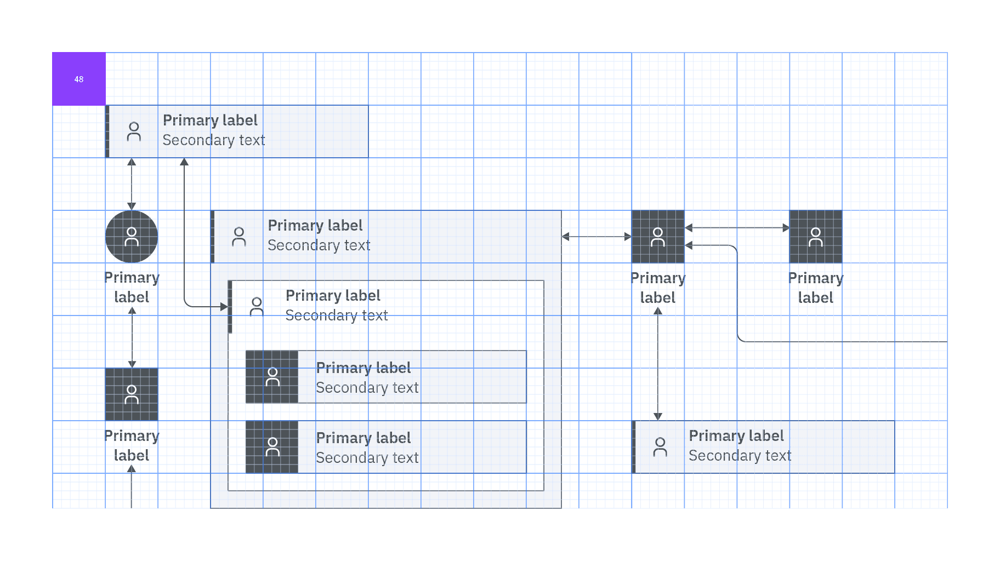

<PageDescription>

Technical diagrams serve many purposes at IBM. They can be used to describe relationships among the elements of a system, the hierarchy of a certain structure or introduce the idea of an ordering sequence to represent a process flow.

</PageDescription>

<AnchorLinks>
  <AnchorLink>Examples</AnchorLink>
  <AnchorLink>Nodes</AnchorLink>
  <AnchorLink>Connectors</AnchorLink>
  <AnchorLink>Iconography</AnchorLink>
  <AnchorLink>Typography</AnchorLink>
  <AnchorLink>Grid and spacing</AnchorLink>
  <AnchorLink>Color</AnchorLink>
  <AnchorLink>Additional elements</AnchorLink>
</AnchorLinks>

## Resources

<Row className="resource-card-group">
<Column colMd={4} colLg={4} noGutterSm>
<ResourceCard
  subTitle="Technical diagrams starter kit"
  href="/files/Technical-diagrams-kit_v1.ai"
  actionIcon="launch"
>

</ResourceCard>
</Column>
</Row>

## Examples

<ImageGallery>
<ImageGalleryImage alt="IT architecture diagram using nested nodes to explain operation hierarchy and relationships" title="IT architecture diagram using nested nodes to explain operation hierarchy and relationships" col={8}>

<ArtDirection>

</ArtDirection>

</ImageGalleryImage>
<ImageGalleryImage alt="it system context diagram" title="it system context diagram" col={4}>

</ImageGalleryImage>
<ImageGalleryImage alt="workflow diagram" title="workflow diagram" col={4}>

</ImageGalleryImage>
<ImageGalleryImage alt="operational model" title="operational model" col={8}>

<ArtDirection>

</ArtDirection>

</ImageGalleryImage>
<ImageGalleryImage alt="dendogram example with flow from record to module to business object to string" title="dendogram example with flow from record to module to business object to string" col={8}>

<ArtDirection>

</ArtDirection>

</ImageGalleryImage>
</ImageGallery>

## Nodes

Technical diagrams consist of nodes and connectors. The nodes come in three different formats: bullet, small and large. They can have various shapes and colors and make use of iconography or not. The meaning of nodes in a diagram depends on the type of diagram and the specific use case. 

### Bullet nodes

Bullet nodes are useful for tree diagrams, dendrograms and other types of very dense network diagrams. Bullet nodes are the most compact form of a node. If using a horizontal label format, the node shape appears to the left of the primary label text. If using a vertical label format, the node shape appears centered above the primary label. They are usually not mixed with other types of nodes in the same diagram. They shouldn’t be used with long names or descriptions. 

<Row>
<Column colMd={4} colLg={4}>

<Caption>Vertical and horizontal types of bullet nodes</Caption>

</Column>
<Column colMd={4} colLg={4}>

<Caption>Examples of color and shape variations for bullet nodes</Caption>

</Column>
</Row>

### Small nodes

Small nodes are useful to represent concepts and relationships in simple layouts, such as high-level presentations or overview diagrams. For complex diagrams, small nodes can also appear with large nodes in the same diagram.

Small nodes always need to include an icon and usually place more emphasis on color than the other types of nodes. We recommend you avoid long names or descriptions.

<Row>
<Column colMd={4} colLg={4}>

<Caption>Vertical and horizontal types of small nodes</Caption>

</Column>
<Column colMd={4} colLg={4}>

<Caption>Examples of color and shape variations for small nodes</Caption>

</Column>
</Row>

### Large nodes

Large nodes are appropriate for elements that require more room for longer names and descriptions, and are usually used in more complex technical diagrams, where the text carries the most meaning. In general, they take up more space than bullet or small nodes, but are an excellent choice for layouts where nodes need to create clear columns or rows, such as swimlane diagrams and organizational charts. Large nodes can be used with or without an icon.

<Row>
<Column colMd={4} colLg={4}>

<Caption>Large nodes with icons</Caption>

</Column>
<Column colMd={4} colLg={4}>

<Caption>Large nodes without icons</Caption>

</Column>
</Row>
<Row>
<Column colMd={4} colLg={4}>

<Caption>Examples of color and shape variations using a White background</Caption>

</Column>
<Column colMd={4} colLg={4}>

<Caption>Examples of color and shape variations using a Color 10 background</Caption>

</Column>
</Row>

#### Text behavior in large nodes

The three different types of large nodes can all accommodate more or less text, or have other nodes nested in them. Click the tabs of the switcher shown here to see how they behave in various scenarios.

<Row>
<Column colLg={8} colMd={8}>
<Tabs>
<Tab label="Outlined node">

<GifPlayer color='dark' className="video-player">
<ArtDirection>

<video src="./images/design/nodes/large-nodes-animations/outlined_node-mobile.mp4" autoPlay loop muted />

<video src="./images/design/nodes/large-nodes-animations/outlined_node.mp4" autoPlay loop muted />

</ArtDirection>
<ArtDirection>

</ArtDirection>
</GifPlayer>

</Tab>
<Tab label="Side bar node">

<GifPlayer color='dark' className="video-player">
<ArtDirection>

<video src="./images/design/nodes/large-nodes-animations/sidebar_node-mobile.mp4" autoPlay loop muted />

<video src="./images/design/nodes/large-nodes-animations/sidebar_node.mp4" autoPlay loop muted />

</ArtDirection>
<ArtDirection>

</ArtDirection>
</GifPlayer>

</Tab>
<Tab label="Color block node">

<GifPlayer color='dark' className="video-player">
<ArtDirection>

<video src="./images/design/nodes/large-nodes-animations/block_node-mobile.mp4" autoPlay loop muted />

<video src="./images/design/nodes/large-nodes-animations/block_node.mp4" autoPlay loop muted />

</ArtDirection>
<ArtDirection>

</ArtDirection>
</GifPlayer>

</Tab>
</Tabs>
</Column>
</Row>

### Nesting

All large node types can expand to allow for nesting. All other types of nodes can be nested inside an expanded large node. 

<Row>
<Column colMd={4} colLg={4}>

<Caption>Example of expanded large node with solid color block</Caption>

</Column>
<Column colMd={4} colLg={4}>

<Caption>Example of expanded outlined large node</Caption>

</Column>
</Row>

## Connectors

Connectors represent relationships between nodes. Depending on the type of diagram, a number of line styles and endings can be used to represent various types of relationships.

Connectors can also use different colors. However, to avoid color blindness accessibility issues, it’s best to use color in combination with labels or line styles so that any difference can be accessible to all users. Since line styles and color can have different meanings, depending on the diagram, be sure to include the definitions in the legend. 

In terms of layout, connectors should be drawn orthogonally on the grid, using straight or rounded elbows. In some cases, the clarity of the diagram may be improved by the use of Bézier curves. 

<Row>
<Column colMd={4} colLg={4}>

<Caption>Examples of line styles</Caption>

</Column>
<Column colMd={4} colLg={4}>

<Caption>Examples of ending styles</Caption>

</Column>
</Row>

## Iconography

Because technical diagrams can be very complex and use icons at small scales, UI icons should be used for most iconography needs. The icons used in nodes are 20px, while the icons used in labels or as indicator badges are 16px. If you don’t find an appropriate icon in the IBM Design Language [UI icon library](/iconography/ui-icons/library/), you can request to add your own design using the approved UI icon [contribution process](/iconography/ui-icons/contribute/). Use either a White or a Black icon, depending on the background.

IBM app icons can also be used if you need to represent a specific IBM product.  Use either the color version on a White or Black background, or the monochrome version on a color background, following the same rules as UI icons.

<Row>
<Column colMd={4} colLg={4}>

<Caption>Use of Black or White UI icons, depending on the fill color</Caption>

</Column>
<Column colMd={4} colLg={4}>

<Caption>Use of app icons on monochromatic and colored fills</Caption>

</Column>
</Row>

### Logos

There are situations where, instead of icons, you may need to use a logo. Keep this option as a last resort, and only use it if you really need to emphasize the brand. For third-party companies, be sure you have legal approval to use their logo, and comply with their brand guidelines. If the logo used has square proportions, constrain it within a 32px x 32px container. If it’s a much wider or taller logo, it’s best to type out the name of the company and use an icon instead, or opt to use no icon. As a general rule, keep the background White when using a logo, and you can choose to use a color for the outline.

<Row>
<Column colMd={4} colLg={4}>

<Caption>A logo can be placed in a square container.</Caption>

</Column>
<Column colMd={4} colLg={4}>

<Caption>Spelled out company names can be used with or without icons.</Caption>

</Column>
</Row>

## Typography

The default typeface for technical diagrams is IBM Plex® Sans. The type specifications are shown here.

| Element               | Size      | Weight   |
| --------------------- | --------- | -------- |
| Node primary label    | 14/18px   | Semibold |
| Node secondary text   | 14/18px   | Regular  |
| Connector label       | 12/16px   | Regular  |
| Text badge            | 12/16px   | Regular  |

### Alignment

Horizontally, type is almost always left aligned, with a few exceptions: when placed underneath the shape, the type in bullet nodes and small nodes is centered on the shape.

In nodes with left-aligned type, alignment depends on the amount of text. If text is just one or two lines, vertically center it. If more than two lines, top align the text. Use an 8px top margin, excluding top leading.

<Row>
<Column colMd={8} colLg={8}>

<GifPlayer color='dark' className="video-player">
<ArtDirection>

<video src="./images/design/typography/type-animation/typography-mobile.mp4" autoPlay loop muted />

<video src="./images/design/typography/type-animation/typography.mp4" autoPlay loop muted />

</ArtDirection>
<ArtDirection>

</ArtDirection>
</GifPlayer>

</Column>
</Row>

<DoDontRow>
<DoDont type="dont" aspectRatio="1:1" caption="Don’t alter the color of the text.">

</DoDont>
<DoDont type="dont" aspectRatio="1:1" caption="Don’t use all caps except for acronyms.">

</DoDont>
</DoDontRow>
<DoDontRow>
<DoDont type="dont" aspectRatio="1:1" caption="Don’t change type size and alignment specifications.">

</DoDont>
<DoDont type="dont" aspectRatio="1:1" caption="Don’t use unnecessarily long label names. Consider adding longer descriptions outside the diagram.">

</DoDont>
</DoDontRow>

## Grid and spacing

Use the guidance shown here when creating a diagram to increase legibility and maintain adherence to the IBM Design Language. 

### Drawing a node

All nodes are built on an 8px grid. The small and large nodes start from a 48px default height. The default outline weight for all nodes is 1px, and the default icon size is 20px. Text margins are 8px for bullet nodes and small nodes, and 16px for large nodes. Use an 8px radius when rounding corners. The node behavior when the labels are longer is described in the [typography section](#typography), while nesting is detailed in the [nesting section](#nesting). 

<Row>
<Column colMd={4} colLg={4}>

<Caption>Bullet node specifications</Caption>

</Column>
<Column colMd={4} colLg={4}>

<Caption>Small node specifications</Caption>

</Column>
</Row>
<Row>
<Column colMd={4} colLg={4}>

<Caption>Large node with icons specifications</Caption>

</Column>
<Column colMd={4} colLg={4}>

<Caption>Large node without icons specifications</Caption>

</Column>
</Row>
<Row>
<Column colMd={4} colLg={4}>

<Caption>8px radius for rounded corners</Caption>

</Column>
<Column colMd={4} colLg={4}>

<Caption>Spacing within nested nodes</Caption>

</Column>
</Row>

### Drawing on the grid

Drawing a technical diagram starts with an 8px grid. All nodes and connectors should snap to the grid. For an orderly diagram, keep connector snap points on the grid, and align elements with each other whenever possible. Since 48px is the default size for nodes, a 48px grid overlay could help the alignment. 

<Row>
<Column colMd={8} colLg={8}>

<ArtDirection>

</ArtDirection>

</Column>
</Row>

### Artboards

Working with as few artboard sizes as possible will ensure size consistency for diagrams across your project. It’s recommended to use one of these standard size artboard widths: 1584px, 1312px or 1080px. Also, try to use one of our standard aspect ratios: 16:9, 4:3, 2:1 or 1:1. Be intentional and consistent when using other sizes and aspect ratios.

## Color

Technical diagrams can use the full IBM Design Language [color palette](/color/) while considering accessibility requirements. Each team can create their own subset to match their needs. A legend is always needed, even when a predefined color set is used.

### Color usage

These color guidelines are meant to ensure accessibility compliance while offering sufficient flexibility. Never rely on color alone to convey meaning. Always make sure there’s a label, line style or icon that aids accessibility for people with color blindness.

For the light theme, the canvas is White, the primary colors are swatches between Color 50 and 80 or Black, the secondary colors are White or Color 10 and the text is always Black. For the dark theme, the canvas is Gray 100, the primary colors are swatches between Color 30 and 50 or White, the secondary colors are Gray 100 or Color 90 and the text is always White. 

The primary colors exceed a 3:1 contrast ratio with the background and secondary colors. Use primary colors for node outlines, side bars, color blocks and connectors. Use secondary colors only for fills. 

Except for app icons or third-party logos, only use Black or White for icons, and make sure you choose the correct color for the context to ensure readability.

| Element            | Light theme         | Dark theme            |
| ----------------- | -------------------- | --------------------- |
| Canvas            | White                | Gray 100              |
| Primary color     | Color 50–80 or Black | Color 30–50 or White  |
| Secondary color   | White or Color 10    | Gray 100 or Color 90  |
| Text              | Black                | White                 |

<Row>
<Column colLg={8} colMd={8} className="dark-second-tab">
<Tabs>
<Tab label="Light theme">

<GifPlayer color='dark' className="video-player">
<ArtDirection>

<video src="./images/design/color/color-animation/color2-light-mobile.mp4" autoPlay loop muted />

<video src="./images/design/color/color-animation/color2-light.mp4" autoPlay loop muted />

</ArtDirection>
<ArtDirection>

</ArtDirection>
</GifPlayer>

</Tab>
<Tab label="Dark theme">

<GifPlayer color='light' className="video-player">
<ArtDirection>

<video src="./images/design/color/color-animation/color2-dark-mobile.mp4" autoPlay loop muted />

<video src="./images/design/color/color-animation/color2-dark.mp4" autoPlay loop muted />

</ArtDirection>
<ArtDirection>

</ArtDirection>
</GifPlayer>

</Tab>
</Tabs>
</Column>
</Row>

<DoDontRow>
<DoDont type="dont" aspectRatio="1:1" caption="Don’t use a transparent background for nested elements because the color of child nodes may become unclear.">

</DoDont>
<DoDont type="dont" aspectRatio="1:1" caption="Don’t mix colors when drawing a node. Nodes should be monochromatic.">

</DoDont>
</DoDontRow>
<DoDontRow>
<DoDont type="dont" aspectRatio="1:1" caption="Don’t use low contrast for important graphic elements.">

</DoDont>
<DoDont type="dont" aspectRatio="1:1" caption="Don’t rely on background fills to differentiate between categories of elements.">

</DoDont>
</DoDontRow>

## Additional elements

Sometimes it’s desirable to provide additional information on a technical diagram. The elements described here are provided to help you translate complex concepts in your technical diagrams. 

### Line styles

Line styles can be used in nodes and connectors to indicate status, to mark changing elements or simply to distinguish between categories. For unlabeled connectors, it’s recommended to use line style differentiations on top of color differentiation for accessibility consideration. Always include the line styles used in a diagram in the legend. 

<Row>
<Column colMd={8} colLg={8}>

<ArtDirection>

</ArtDirection>

</Column>
</Row>

### Indicator badges

To add another layer of meaning to a diagram, indicator badges can be used. They are 16px icons or shapes, optionally containing characters. They can be used with colors, including the alert colors, or in Black and White. These badges are used flexibly, for example, to show categories or statuses, or if a particular characteristic needs to be called out. However, a diagram should only use indicator badges for one reason at a time. Always add the indicator badges used in a diagram to the legend. For more information about status indicators, consult the Carbon [status indicators guidance](https://carbondesignsystem.com/patterns/status-indicator-pattern/). 

<Row>
<Column colMd={8} colLg={8}>

<ArtDirection>

</ArtDirection>

</Column>
</Row>

### Multiple instances

To represent multiple instances of the same element, an offset effect can be used, as shown here. Always show an additional two offset lines, regardless of the actual number of repetitions. Mention the number of instances in parentheses at the end of the element name.

<Row>
<Column colMd={8} colLg={8}>

<ArtDirection>

</ArtDirection>

</Column>
</Row>