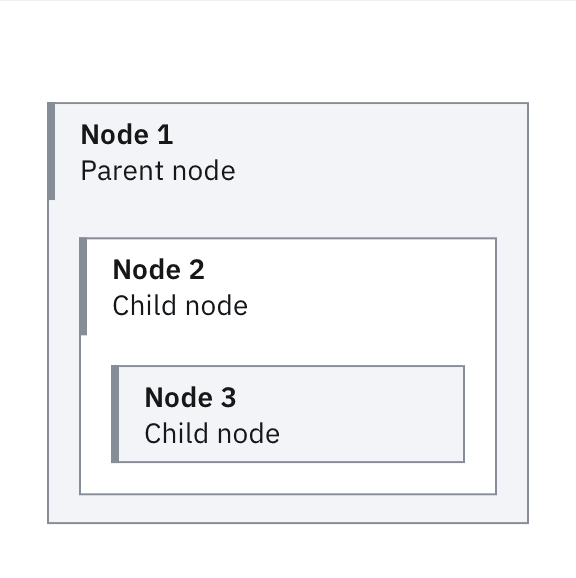
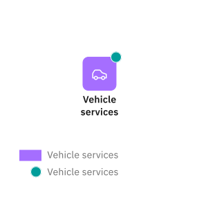

import { itArchitectureDiagrams } from '../../../styles/Grid.module.scss';

<PageDescription>

Technical diagrams serve many purposes at IBM. They can be used to describe relationships among the elements of a system, the hierarchy of a certain structure or introduce the idea of an ordering sequence to represent a process flow.

</PageDescription>

<AnchorLinks>
  <AnchorLink>Examples in use</AnchorLink>
  <AnchorLink>Clarity</AnchorLink>
  <AnchorLink>Carbon</AnchorLink>
  <AnchorLink>Subsystems</AnchorLink>
</AnchorLinks>

## Examples in use

<ImageGallery>

<ImageGalleryImage alt="Technical diagram on a web page" title="Technical diagram on a web page" col={4}>

</ImageGalleryImage>
<ImageGalleryImage alt="Poster printout of technical diagram to encourage team input" title="Poster printout of technical diagram to encourage team input" col={8}>

</ImageGalleryImage>
<ImageGalleryImage alt="technical diagram with dark theme background on laptop slide presentation" title="technical diagram with dark theme background on laptop slide presentation" col={8}>

</ImageGalleryImage>
<ImageGalleryImage alt="technical diagram within a white paper" title="technical diagram within a white paper" col={4}>

</ImageGalleryImage>

</ImageGallery>

## Clarity

When creating a technical diagram, clarity and legibility are paramount. These guidelines were developed to help, as well as ensure brand consistency. Try to follow them as closely as possible. Depending on the tools used to create diagrams, there may be certain limitations, however clarity should never be sacrificed.

<DoDontRow>
<DoDont type="do" aspectRatio="1:1" caption="Always add a legend to your diagram, showing the color, line, style and shape conventions used.">

</DoDont>
<DoDont type="dont" aspectRatio="1:1" caption="Don’t use icons by themselves to represent essential information—always use words, as well.">

</DoDont>
</DoDontRow>
<DoDontRow>
<DoDont type="do" aspectRatio="1:1" caption="When a diagram can’t be displayed at 100% scale, offer the user a way to download it or zoom in.">

</DoDont>
<DoDont type="do" aspectRatio="1:1" caption="Alternate background fill colors to improve nesting readability.">

</DoDont>
</DoDontRow>
<DoDontRow>
<DoDont type="dont" aspectRatio="1:1" caption="Avoid redundancy when using shapes, styles, colors or indicator badges.">

</DoDont>
<DoDont type="dont" aspectRatio="1:1" caption="Don’t mix types of nodes unless they have specific semantic differences that can’t be expressed otherwise.">

</DoDont>
</DoDontRow>

## Carbon

The technical diagrams guidance presented here is meant for diagrams that appear outside of product screens, such as those found in documentation websites, in presentations, on collateral and so on. When creating a technical diagram as part of a product, use the Carbon components and Carbon for IBM Products guidance instead. 

<Row className="resource-card-group">
<Column colMd={4} colLg={4} noGutterSm>
<ResourceCard
  subTitle="Carbon network diagrams"
  href="https://www.carbondesignsystem.com/data-visualization/complex-charts/#network-diagrams"
  actionIcon="launch"
>

</ResourceCard>
</Column>
<Column colMd={4} colLg={4} noGutterSm>
<ResourceCard
  subTitle="Carbon tree diagrams"
  href="https://www.carbondesignsystem.com/data-visualization/complex-charts/#tree-diagrams"
  actionIcon="launch"
>

</ResourceCard>
</Column>
<Column colMd={4} colLg={4} noGutterSm>
<ResourceCard
  subTitle="Carbon for IBM Products guidance (w3id required)"
  href="https://pages.github.ibm.com/cdai-design/pal/patterns/canvas/usage"
  actionIcon="launch"
>

</ResourceCard>
</Column>
</Row>

## Subsystems

Using our technical diagram guidance as a foundation, some teams have expanded on our system. They’ve built a number of discrete extensions, effectively creating subsystems that specifically address their exact use cases. If you work with one of these subsystems, do follow our general guidance, as well as the specific adaptations applicable to your use case. If you believe you have an application that requires new elements, reach out to the IBM brand design team with your proposal for approval. It helps ensure that your technical diagram subsystem adheres to our general guidance, and gives us the opportunity to share it here with all teams.

### IT architecture

[The IBM Unified Method Framework](https://w3.ibm.com/w3publisher/ibm-architect-profession/education#Architectural_Thinking) is the modelling standard used by IBM for IT architecture. When creating an IT architecture diagram, follow the visual guidance developed specifically for this type of diagram. Doing so helps ensure correct interpretation of your architectural model.

The visual vocabulary developed for IT architecture diagrams corresponds to the main elements used in architecture models:

<Row className={itArchitectureDiagrams}>
<Column colMd={2} colLg={4}>

Target IT system  The system being modelled and engineered

</Column>
<Column colMd={6} colLg={7}>

<ArtDirection>

</ArtDirection>

</Column>
</Row>

<Row className={itArchitectureDiagrams}>
<Column colMd={2} colLg={4}>

Actor  An external IT system or a user interacting with the target system

</Column>
<Column colMd={6} colLg={7}>

<ArtDirection>

</ArtDirection>

</Column>
</Row>

<Row className={itArchitectureDiagrams}>
<Column colMd={2} colLg={4}>

Node  A collection of deployment units in a location

</Column>
<Column colMd={6} colLg={7}>

<ArtDirection>

</ArtDirection>

</Column>
</Row>

<Row className={itArchitectureDiagrams}>
<Column colMd={2} colLg={4}>

Component  A modular unit of functionality, which makes this functionality available through an interface

</Column>
<Column colMd={6} colLg={7}>

</Column>
</Row>

<Row className={itArchitectureDiagrams}>
<Column colMd={2} colLg={4}>

Deployment unit  Nonfunctional aspects of a component

</Column>
<Column colMd={6} colLg={7}>

<ArtDirection>

</ArtDirection>

</Column>
</Row>

<Row className={itArchitectureDiagrams}>
<Column colMd={2} colLg={4}>

Location  A group representing a geographical area or position

</Column>
<Column colMd={6} colLg={7}>

<ArtDirection>

</ArtDirection>

</Column>
</Row>

<Row className={itArchitectureDiagrams}>
<Column colMd={2} colLg={4}>

Zone  A group aggregating a number of model elements with a common set of values for a specific nonfunctional requirement

</Column>
<Column colMd={6} colLg={7}>

<ArtDirection>

</ArtDirection>

</Column>
</Row>

<Row className={itArchitectureDiagrams}>
<Column colMd={2} colLg={4}>

Subsystem  Any subset of the model elements and element relationships of a system

</Column>
<Column colMd={6} colLg={7}>

<ArtDirection>

</ArtDirection>

</Column>
</Row>

### IT architecture diagrams resources

<Row className="resource-card-group">
<Column colMd={4} colLg={4} noGutterSm>
<ResourceCard
  subTitle="IT architecture visualization techniques (w3id required)"
  href="https://w3.ibm.com/w3publisher/it-architecture-visualization-techniques"
  actionIcon="launch"
/>
</Column>
<Column colMd={4} colLg={4} noGutterSm>
<ResourceCard
  subTitle="Cognitive Architect (Internal users, w3id required)"
  href="https://w3.ibm.com/tools/cogarch/pagelogin"
  actionIcon="launch"
/>
</Column>
<Column colMd={4} colLg={4} noGutterSm>
<ResourceCard
  subTitle="Cognitive Architect (External users)"
  href="https://it.architect-assistant.ibm.com/register/"
  actionIcon="launch"
/>
</Column>
<Column colMd={4} colLg={4} noGutterSm>
<ResourceCard
  subTitle="IBM Hybrid Cloud Architecture Center"
  href="https://www.ibm.com/architectures/hybrid"
  actionIcon="launch"
/>
</Column>
<Column colMd={4} colLg={4} noGutterSm>
<ResourceCard
  subTitle="Diagrams.net library (w3id required)"
  href="https://github.ibm.com/innersource/ibmdiagrams"
  actionIcon="launch"
>

</ResourceCard>
</Column>
<Column colMd={4} colLg={4} noGutterSm>
<ResourceCard
  download
  subTitle="IT architecture diagrams starter kit, PowerPoint (w3id required)"
  href="https://ibm.box.com/s/z8vmk41w195vehryf64wf7qj10rdg9g8"
  actionIcon="launch"
>

</ResourceCard>
</Column>
<Column colMd={4} colLg={4} noGutterSm>
<ResourceCard
  subTitle="Architecture tools and stencils"
  href="https://www.ibm.com/architectures/diagram-tools"
  actionIcon="launch"
/>
</Column>
</Row>

### Product documentation

All products created by IBM have some related documentation. Often, this documentation includes various types of technical diagrams, such as flows, process diagrams, network diagrams and so on. Whenever you need to create a diagram representing a system of parts and the relationship between them, start from our general technical diagrams guidance. Various teams have developed subsystems tailored to their specific applications. Check this Box folder for customized kits.

<Row className="resource-card-group">
<Column colMd={4} colLg={4} noGutterSm>
<ResourceCard
  subTitle="Various kits for documentation diagrams (IBMid required)"
  href="https://ibm.box.com/s/8xagndzazdw3gi88452vm1ujw8arkz2s"
  actionIcon="launch"
>

</ResourceCard>
</Column>
</Row>
