<PageDescription>

When choosing or creating an IBM image, certain criteria should be considered.
The following guidance will help achieve the effect and impression we’re looking
for.

</PageDescription>

<AnchorLinks>
  <AnchorLink>Perspective</AnchorLink>
  <AnchorLink>Composition</AnchorLink>
  <AnchorLink>Aspect ratio</AnchorLink>
  <AnchorLink>Lighting</AnchorLink>
  <AnchorLink>Depth-of-field</AnchorLink>
  <AnchorLink>Effects and filters</AnchorLink>
  <AnchorLink>Clichés, metaphors & see-say</AnchorLink>
</AnchorLinks>

## Perspective

As IBMers, we are objective observers of the working world. This translates into
the perspectives we commonly use in photography. There are two primary
viewpoints, each deliberately designed to present the world “as-is” and at its
beautiful best.

### Eye level

We are a forward-facing organization. We treat our clients and ourselves as
equals. Imagine IBM or an IBMer is the camera, this is how we view the world
around us; authentically, eye-to-eye, fairly, naturally, truthfully. We take a
step back, capture context, observe the environment, and present a bigger
picture.

<Row className="mock-gallery">

<Column colMd={4} colLg={6}>

</Column>
<Column colMd={4} colLg={6}>

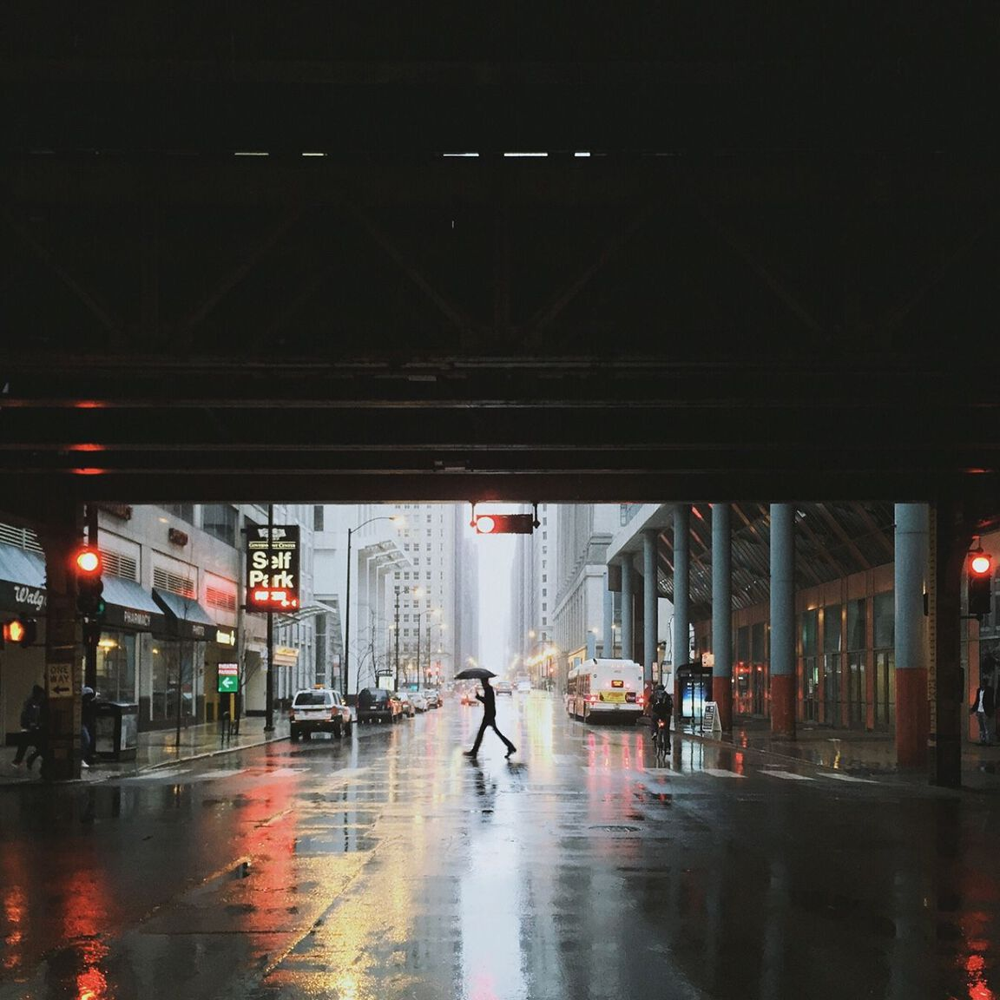

</Column>

</Row>

### Aerial

Used less often, another angle we take is to offer things from a different
perspective. Equally as objective, an aerial view allows us to “elevate” our
observations. This communicates a certain “eye” on consequences and impact at
scale.

<Row className="mock-gallery">

<Column colMd={4} colLg={6}>

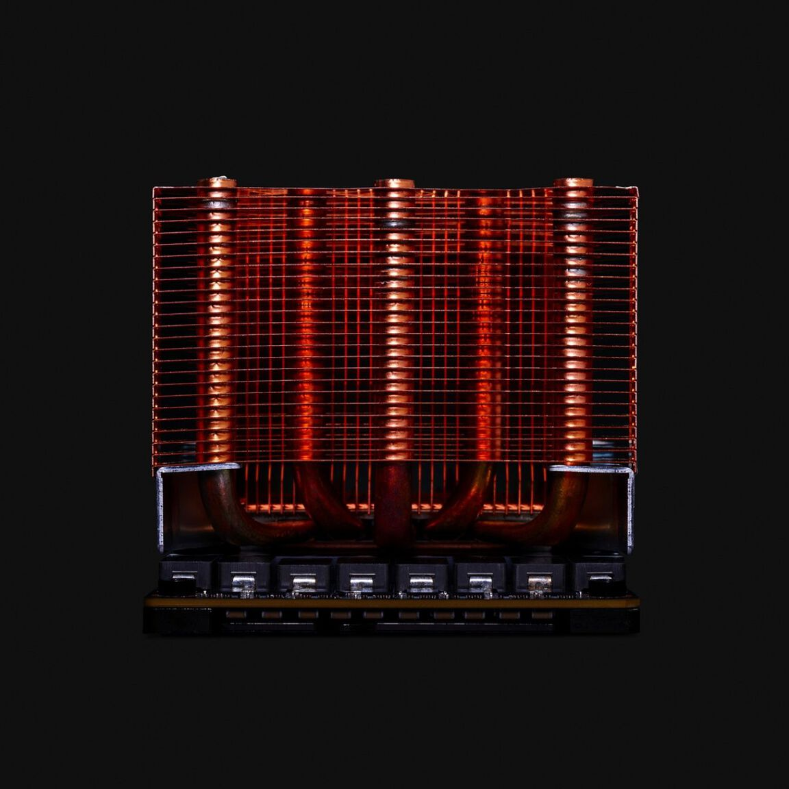

</Column>
<Column colMd={4} colLg={6}>

</Column>

</Row>

<DoDontRow>
<DoDont type="dont" caption="Avoid forced perspectives that attempt to add interest to uninteresting subjects." colMd={3}>

</DoDont>
<DoDont type="dont" caption="Avoid perspectives that are neither overhead or at natural eye-level." colMd={3}>

</DoDont>
</DoDontRow>

## Composition

Image composition is the intentional arrangement of individual subjects within a
scene to form the final image. There are two key aspects to composition that you
should consider for every image.

### Framing

The 2x Grid can be a useful guide when thinking about composing imagery and
positioning subjects. Images should leverage divisions of two. Either horizontal
or vertical, these divisions create zones for subjects, allowing for carefully
considered compositions that feel kinetic, like moments in time.

<ArtDirection>

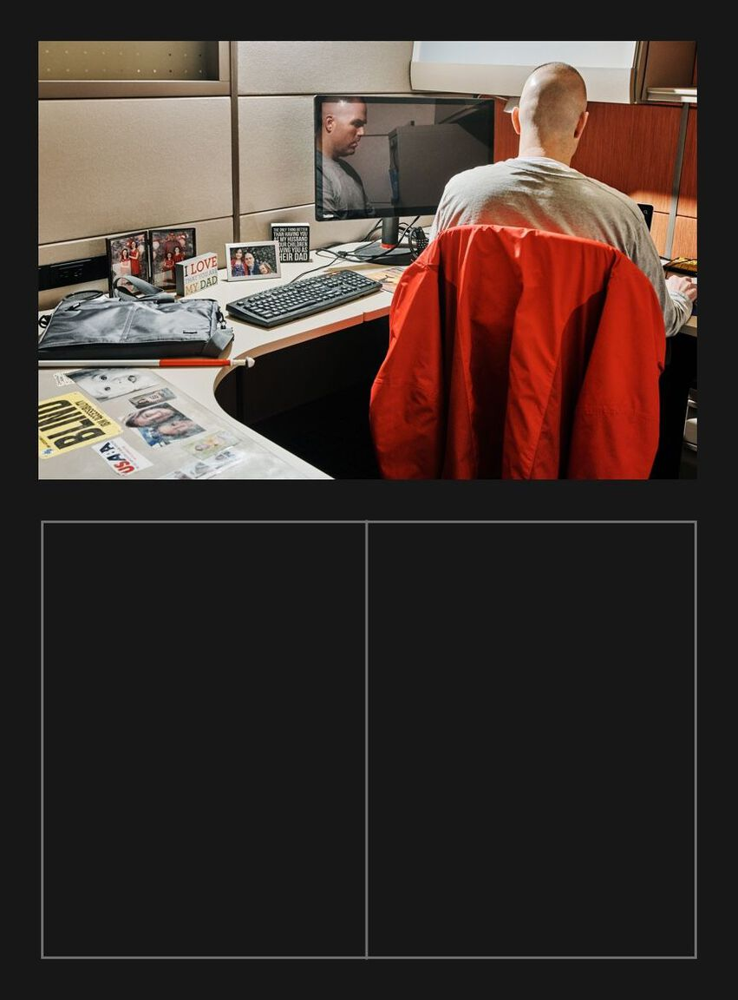
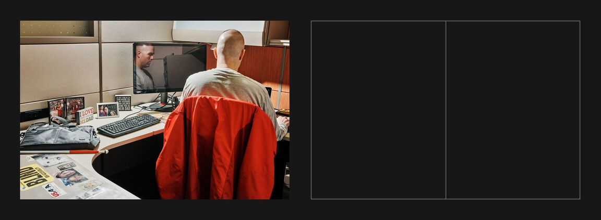

</ArtDirection>

<Caption>Vertical</Caption>

<ArtDirection>

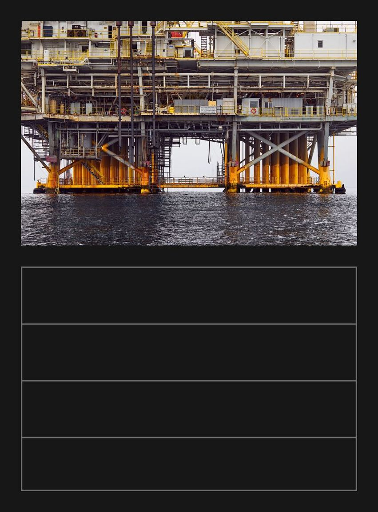

</ArtDirection>

<Caption>Horizontal</Caption>

### Focal points

Use the 2x Grid to establish clear focal points. It may seem prescriptive, but
when seen together this approach acts as connective tissue between IBM images.
The same approach is used to create delightful film experiences.

<ArtDirection>

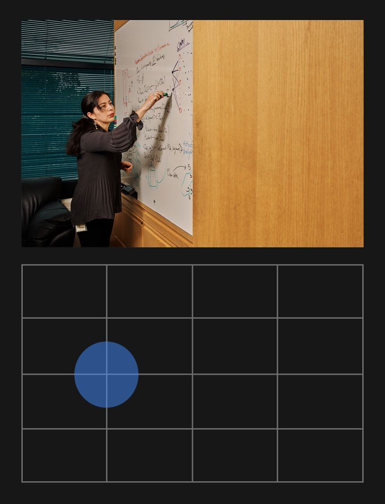
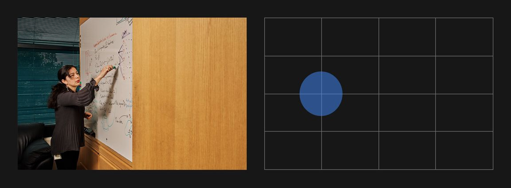

</ArtDirection>

<ArtDirection>

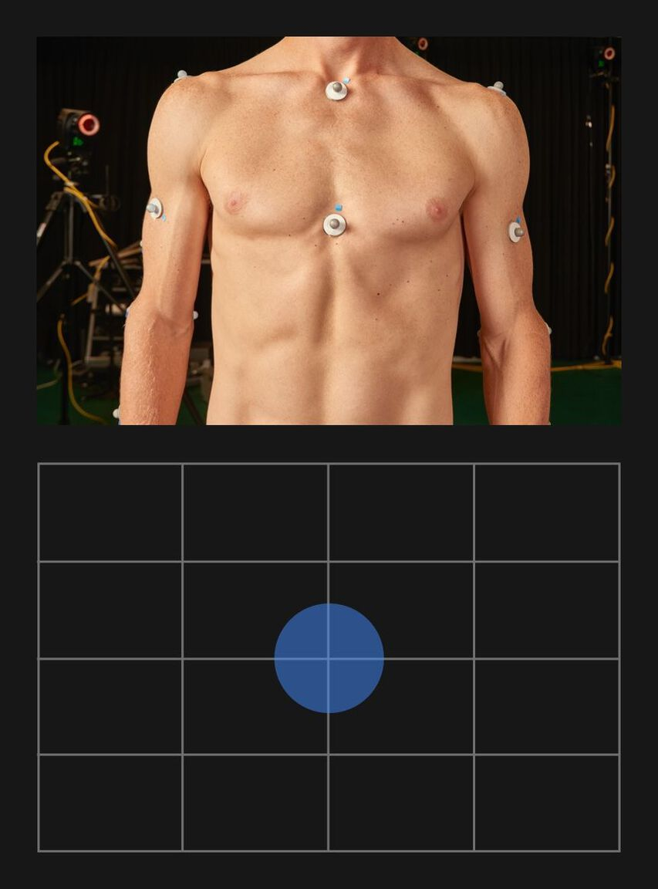
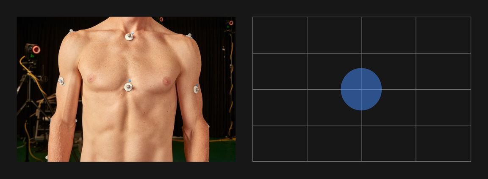

</ArtDirection>

<DoDontRow>
<DoDont
  type="dont"
  caption="Avoid having no center of interest and drawing attention to an empty center" colMd={3}>

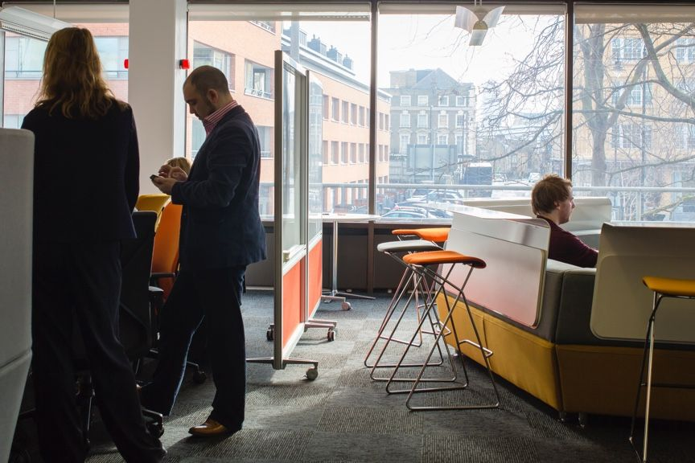

</DoDont>
<DoDont
  type="dont"
  caption="Avoid conflicting focal points and no clear alignments to a grid" colMd={3} >

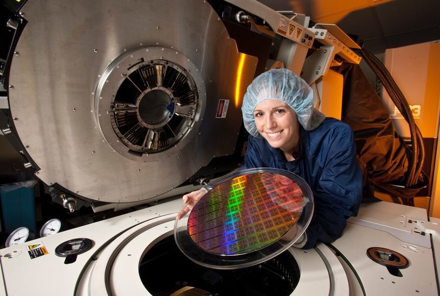

</DoDont>
</DoDontRow>

## Aspect ratio

When cropping images, use a common 16:9, 4:3, 3:2, 2:1 or 1:1 aspect ratio
unless otherwise specified for a particular format. These common aspect ratios
work well with our 2x Grid foundation. They help create a visual rhythm within
everything created using IBM Design Language—from UI components to signage,
event spaces and beyond.

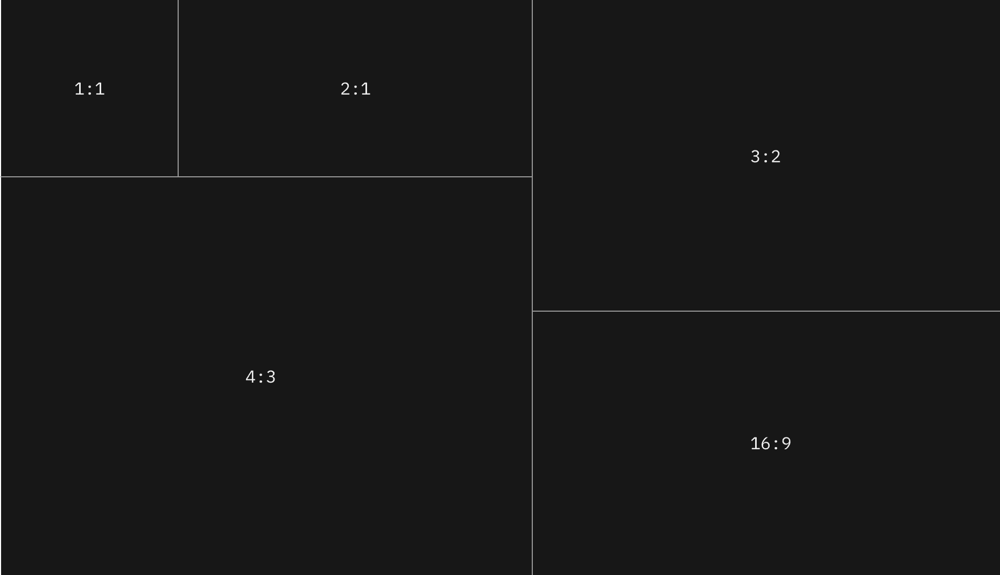

## Lighting

Whenever possible, use natural light or techniques that simulate natural light.
IBM imagery is allergic to artificiality. The sincere portrayal of subject is
paramount. We cannot manufacture a better reality than reality itself.

<DoDontRow>
<DoDont
  type="dont"
  caption="Avoid overly warm, glowing, or “golden hour” photographs" colMd={3} >

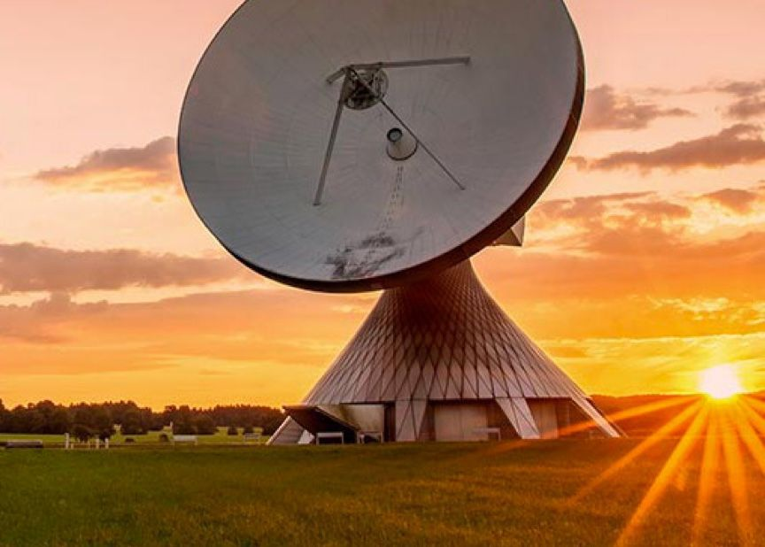

</DoDont>
<DoDont
  type="dont"
  caption="Avoid color washes and grading" colMd={3}>

</DoDont>
</DoDontRow>

## Depth-of-field

Everything should be in sharp focus. This crisp approach reinforces a deep
interest in everything, and an emphasis on context and detail. Everything is
presented evenly.

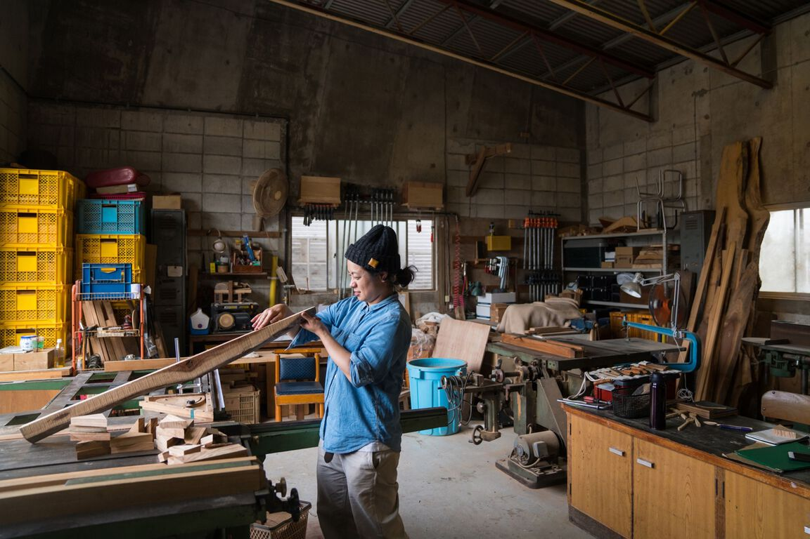

<DoDontRow>
<DoDont
  type="dont"
  caption="Avoid images with soft focus" colMd={3} >

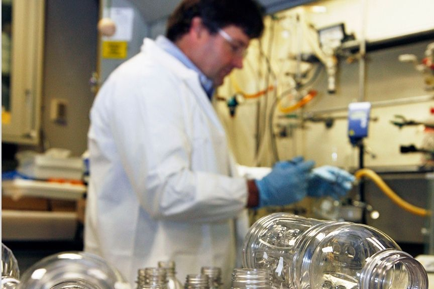

</DoDont>
<DoDont
  type="dont"
  caption="Avoid images that fall off focus too quickly" colMd={3} >

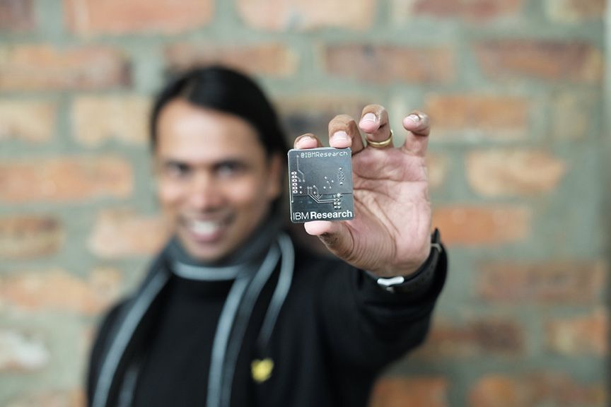

</DoDont>
</DoDontRow>

## Effects and filters

Avoid anything artificial. We’re a fact-based company. We communicate with
clarity, and our photography should communicate this too. We avoid hyperbole and
jargon. Our imagery should avoid spin and overstyling as well.

<DoDontRow>
<DoDont
  type="dont"
  caption="Avoid images with added glare or elements that have been clearly added via photoshop" colMd={3} >

</DoDont>
<DoDont
  type="dont"
  caption="Avoid images that have color or image overlays" colMd={3} >

</DoDont>
</DoDontRow>

## Clichés, metaphors & see-say

When it comes to photography, people respond to what they don’t see as much as
what they do see. Too often, imagery is used to double-down on what is already
understood versus adding depth and dimension. We should use imagery
purposefully, to expand ideas and elicit emotion.

We are a fact-based, insightful, opinionated organization. Therefore, we try to
avoid abstraction in favor of palatability and tangibility. If an image looks
like it could have been created by any other organization, it’s probably lacking
a distinct point-of-view (style or subject) or purposeful use that is uniquely
IBM.

<DoDontRow>
<DoDont
  type="dont"
  caption="Avoid cliché images that attempt to loosely represent a concept while not portraying the real world at work" colMd={3} >

</DoDont>
<DoDont
  type="dont"
  caption="Avoid images that are both unrealistic and common" colMd={3} >

</DoDont>
</DoDontRow>
