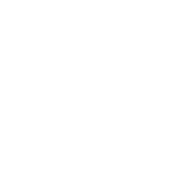

import HomepageTemplate from "gatsby-theme-carbon/src/templates/Homepage";
import HomepageTile from "../components/HomepageTile";
import Carousel from "../components/Carousel";

import { Row, Column, ImageCard, ResourceCard } from "gatsby-theme-carbon";

export default HomepageTemplate;

temporary file, starting to replace homepage with updated components

<Row>
<Column colMd={4} colLg={4} noGutterSm>
<ImageCard
  title="Components"
  subTitle="Carbon 10"
  href="https://www.carbondesignsystem.com"
  titleColor="dark"
  subTitleColor="dark"
  iconColor="dark"
  actionIcon="launch"
  >

</ImageCard>
    <ResourceCard
      subTitle="Design Kit"
      title="Explore & Create"
      aspectRatio="1:1"
      actionIcon="launch"
      color="dark"
      href="https://www.ibm.com/standards/web/design-kit/"
      >

  </ResourceCard>
</Column>
<Column colMd={4} colLg={4} noGutterSm>
<ImageCard
  title="2x Grid"
  subTitle="Elements"
  href="/elements/2x-grid"
  titleColor="light"
  subTitleColor="light"
  iconColor="light"
  actionIcon="arrowRight"
  >

</ImageCard>
    <ResourceCard
      subTitle="GitHub repo"
      title="Design & Development"
      aspectRatio="1:1"
      actionIcon="launch"
      color="dark"
      href="https://www.ibm.com/standards/web/design-kit/"
      >

  </ResourceCard>
</Column>
<Column colMd={4} colLg={4} noGutterSm>
<ImageCard
  title="Icon Usage"
  subTitle="Icons"
  href="/elements/2x-grid"
  actionIcon="arrowRight"
  aspectRatio="1:2"
  >

</ImageCard>
</Column>
<Column colMd={4} colLg={4} noGutterSm>
    <ResourceCard
      subTitle="Elements"
      title="Color in UI"
      aspectRatio="2:1"
      actionIcon="arrowRight"
      color="dark"
      href="https://www.ibm.com/standards/web/design-kit/"
      />
<ImageCard
  title="Color Palette"
  subTitle="Elements"
  href="https://www.ibm.com/standards/web/design-kit/"
  actionIcon="arrowRight"
  >

</ImageCard>
</Column>
<Column colMd={4} colLg={8} noGutterSm>
<ImageCard
  title="Color Palette"
  subTitle="Elements"
  href="https://www.ibm.com/standards/web/design-kit/"
  actionIcon="arrowRight"
  hoverColor="dark"
  >

</ImageCard>
</Column>
<Column colMd={4} colLg={4} noGutterSm>
<ImageCard
  href="/elements/type-specs-ui"
  >

</ImageCard>
</Column>
<Column colMd={4} colLg={4} noGutterSm>
    <ResourceCard
      subTitle="Elements"
      title="Type Specs"
      aspectRatio="1:1"
      actionIcon="arrowRight"
      color="dark"
      href="/elements/type-specs-ui/"
      />
</Column>
</Row>

<Row>
  <Column colLg={4} colMd={4} noGutterSm>
<ImageCard
  href="/elements/type-basics/"
  >

</ImageCard>
    <ResourceCard
      subTitle="Elements"
      title="Type Face"
      actionIcon="arrowRight"
      color="dark"
      href="/elements/typeface/"
      />
  </Column>
</Row>

stuff

<Row>
  <Column colLg={4} colMd={4} noGutterSm>
    <HomepageTile
      ratio="1:1" 
      hoverDark
      transparentImage="images/tooltip-components.svg"
      subtitle="Components"
      title="Carbon 10"
      actionIcon="resources"
      link="https://www.carbondesignsystem.com/"
      target="_blank"
    />
    <HomepageTile
      ratio="1:1" 
      theme="dark"
      subtitle="Design Kit"
      title="Explore & Create"
      actionIcon="resources"
      identityIcon="images/SketchIcon.svg"
      link="https://www.ibm.com/standards/web/design-kit/"
      target="_blank"
    />
  </Column>
  <Column colLg={4} colMd={4} noGutterSm>
    <HomepageTile
      ratio="1:1" 
      theme="dark"
      subtitle="Elements"
      title="2x Grid"
      actionIcon="article"
      transparentImage="images/grid-temp.png"
      link="/elements/2x-grid"
    />
    <HomepageTile
      ratio="1:1" 
      theme="dark"
      subtitle="GitHub repo"
      title="Design & development"
      actionIcon="resources"
      identityIcon="images/GitHubIcon.svg"
      link="https://www.ibm.com/standards/web/design-kit/"
      target="_blank"
    />
  </Column>
  <Column colLg={4} colMd={4} noGutterSm>
    <HomepageTile
      ratio="1:2" 
      theme="dark"
      hoverDark
      backgroundColor="#8a3ffc" // if omitted, defaults to #282828
      transparentImage="images/three-icons-stacked.svg"
      subtitle="Icons"
      title="Icon usage"
      actionIcon="article"
      link="https://www.ibm.com/standards/web/design-kit/"
      target="_blank"
    />
  </Column>
  <Column colLg={4} colMd={4} noGutterSm>
    <HomepageTile
      ratio="2:1" 
      theme="dark"
      subtitle="Elements"
      title="Color in UI"
      actionIcon=""
      link="https://www.ibm.com/standards/web/design-kit/"
      target="_blank"
    />
    <HomepageTile
      ratio="1:1" 
      marginTop="50%"
      theme="dark"
      hoverDark
      contentOnHover
      image="images/blue1.jpg"
      subtitle="Elements"
      title="Color Palette"
      actionIcon="article"
      link="https://www.ibm.com/standards/web/design-kit/"
      target="_blank"
    />
  </Column>
  <Column colLg={8} noGutterSm>
    <HomepageTile
      ratio="1:1" 
      theme="dark"
      hoverDark
      image="/images/landing-color-grid.svg"
      subtitle="Elements"
      title="Color Palette"
      actionIcon="article"
      link="https://www.ibm.com/standards/web/design-kit/"
      target="_blank"
    />
  </Column>
  <Column colLg={4} colMd={4} noGutterSm>
 <HomepageTile
            ratio="1:1" 
            theme="dark"
            backgroundColor="rgb(6, 31, 128)" // if omitted, defaults to #282828
            transparentImage="images/type-scales.svg"
            actionIcon="no-icon"
            link="https://www.ibm.com/standards/web/design-kit/"
            target="_blank"
          />
  </Column>
  <Column colLg={4} colMd={4} noGutterSm>
<HomepageTile
            ratio="1:1" 
            theme="dark"
            subtitle="Elements"
            title="Type Specs"
            actionIcon="article"
            link="https://www.ibm.com/standards/web/design-kit/"
            target="_blank"
          />
  </Column>
</Row>
<Row>
  <Column colLg={4} colMd={4} noGutterSm>
    <HomepageTile
        ratio="1:1" 
        theme="dark"
        image="images/landing-plex-animation.gif"
        actionIcon="no-icon"
        link="https://www.ibm.com/standards/web/design-kit/"
        target="_blank"
    />
    <HomepageTile
        ratio="2:1" 
        theme="dark"
        subtitle="Elements"
        title="Typeface"
        actionIcon="article"
        link="https://www.ibm.com/standards/web/design-kit/"
        target="_blank"
    />
  </Column>
  <Column colLg={8} noGutterLg>
  <HomepageTile
    ratio="1:1"
    image="images/product-gallery.jpg"
    actionIcon="no-icon">
    <HomepageTile
        ratio="4:1" 
        theme="dark"
        subtitle="Photography"
        title="IBM Services"
        actionIcon="article"
        link="https://www.ibm.com/standards/web/design-kit/"
        target="_blank"
    />
    </HomepageTile>
  </Column>
</Row>
<Row>
  <Column colLg={12} noGutterLg>
  <HomepageTile
    ratio="16:9"
    image="images/landing-photography-gallery-2.jpg"
    actionIcon="no-icon">
    <Carousel id="c1" count="1 2" nav={false} fade={true} autoplay>
        
        
    </Carousel>
    <HomepageTile
        ratio="6:1" 
        theme="dark"
        subtitle="Elements"
        title="Photography"
        actionIcon="article"
        link="https://www.ibm.com/standards/web/design-kit/"
        target="_blank"
    />
    </HomepageTile>
  </Column>
</Row>
<Row>
  <Column colLg={8} noGutterLg>
   <HomepageTile
    ratio="1:1"
    image="images/landing-gallery-watson-duo-phone.jpg"
    actionIcon="no-icon">
    <HomepageTile
        ratio="4:1" 
        theme="dark"
        subtitle="Case Study"
        title="Coming soon"
        actionIcon=""
        link="https://www.ibm.com/standards/web/design-kit/"
        target="_blank"
    />
    </HomepageTile>
  </Column>
  <Column colLg={4} colMd={4} noGutterSm>
   <HomepageTile
    ratio="1:1" 
    theme="dark"
    subtitle="Philosophy"
    title="Principles"
    actionIcon="article"
    link="https://www.ibm.com/standards/web/design-kit/"
    target="_blank"
    />
  </Column>
  <Column colLg={4} colMd={4} noGutterSm>
   <HomepageTile
    ratio="1:1" 
    theme="dark"
    hoverDark
    backgroundColor="#8a3ffc"
    image="images/landing-illustration-ibm-rand-logo.svg"
    actionIcon="no-icon"
    link="https://www.ibm.com/standards/web/design-kit/"
    target="_blank"
    />
  </Column>
  <Column colLg={4} colMd={4} noGutterSm>
   <HomepageTile
    ratio="1:1" 
    theme="dark"
    subtitle="Philosophy"
    title="Start smart"
    transparentImage="images/big-arrow.svg"
    actionIcon="no-icon"
    link="https://www.ibm.com/standards/web/design-kit/"
    target="_blank"
    />
  </Column>
</Row>
