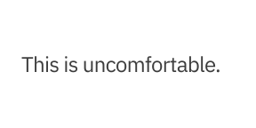
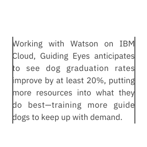
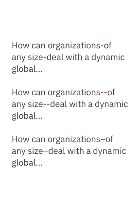
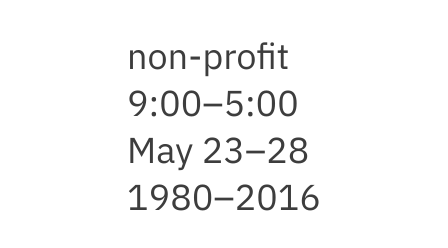

import { noGutterSm } from '../../styles/Grid.module.scss';

<PageDescription>

Good typography often goes unnoticed because it just makes sense. Elements of
good typography include consistency, hierarchy and alignment. With our patented
corporate typeface, IBM Plex, comes an opportunity to recalibrate our
typographic mindset with some best practices.

</PageDescription>

<AnchorLinks>
  <AnchorLink>Tracking</AnchorLink>
  <AnchorLink>Flush left</AnchorLink>
  <AnchorLink>Leading</AnchorLink>
  <AnchorLink>Punctuation</AnchorLink>
  <AnchorLink>Belt and suspenders</AnchorLink>
  <AnchorLink>Case</AnchorLink>
  <AnchorLink>Rags, orphans and widows</AnchorLink>
  <AnchorLink>Alignment</AnchorLink>
  <AnchorLink>Comfortable reading</AnchorLink>
  <AnchorLink>Line lengths within containers</AnchorLink>
  <AnchorLink>Stacked headlines</AnchorLink>
  <AnchorLink>Titles and subtitles</AnchorLink>
</AnchorLinks>

## Resources

<Row className="resource-card-group">
<Column colMd={4} colLg={4} noGutterSm>
    <ResourceCard
      subTitle="IBM Plex® latest typeface version"
      aspectRatio="2:1"
      href="https://github.com/IBM/plex/releases/latest"
      >

  </ResourceCard>
</Column>
<Column colMd={4} colLg={4} noGutterSm>
    <ResourceCard
      subTitle="IBM Plex® website"
      aspectRatio="2:1"
      href="https://www.ibm.com/plex/"
      >

  </ResourceCard>
</Column>
</Row>

## Tracking

Plex® has been designed to not be spaced tightly. It requires space to breathe
comfortably within text and headlines. It’s lighter in appearance and is more
legible when spaced appropriately.

<DoDontRow>
<DoDont colMd="12" colLg="12">
<ArtDirection>

</ArtDirection>
</DoDont>
</DoDontRow>

<DoDontRow>
<DoDont type="dont" colMd="12" colLg="12">
<ArtDirection>

</ArtDirection>
</DoDont>
</DoDontRow>

<DoDontRow>
<DoDont type="dont" colMd="12" colLg="12">
<ArtDirection>

</ArtDirection>

</DoDont>
</DoDontRow>

## Flush left

Flush left creates strong alignments for the eye to follow, aiding readability
and organization. It is our standard for all typography across IBM because it is
functional, modern, timeless and the most effective in information design and
legibility.

<DoDontRow>
<DoDont>
<ArtDirection>

</ArtDirection>
</DoDont>

<DoDont type="dont">
<ArtDirection>

</ArtDirection>
</DoDont>
</DoDontRow>

<DoDontRow>
<DoDont type="dont">
<ArtDirection>

</ArtDirection>
</DoDont>

<DoDont type="dont">
<ArtDirection>

</ArtDirection>
</DoDont>
</DoDontRow>

## Leading

Choosing the appropriate leading or line spacing is very important to the
reading quality and and efficiency of the typography. It should never be to open
or too tight which makes reading difficult and unpleasant for the reader.

<DoDontRow>
<DoDont>

</DoDont>

<DoDont type="dont">

</DoDont>
</DoDontRow>

<DoDontRow>
<DoDont>

</DoDont>
<DoDont type="dont">

</DoDont>
</DoDontRow>

## Punctuation

The use of spacing and certain typographical devices are important to
understanding and correct reading. The typographical details of correct
punctuation aid in interpretation, division of text into sentences and clauses,
and is critical to disambiguate the meaning of sentences.

### Apostrophes and primes

Apostrophes indicate possession, for example, Harry's book or the boys' coats.
They can also indicate the omission of letters or numbers. Primes are commonly
used for minutes, seconds, feet, inches and degrees. Lucky for us, IBM Plex
includes them. Many fonts don’t.

<DoDontRow>
<DoDont>

</DoDont>
<DoDont type="dont">

</DoDont>
</DoDontRow>

<DoDontRow>
<DoDont>
<ArtDirection>

</ArtDirection>
</DoDont>
<DoDont type="dont">
<ArtDirection>

</ArtDirection>
</DoDont>
</DoDontRow>

### Quotes

Use left and right “curly quotes” when quote marks are required. They are design
sensitive, intended to match or blend within Plex. Avoid using "straight"
quotes. These are a relic from the typewriter days, and a common error in modern
typography.

<DoDontRow>
<DoDont>

</DoDont>
<DoDont type="dont">

</DoDont>
</DoDontRow>

### Em dash

The em dash is used to create a strong break in the structure of a sentence.
Hyphens and en dashes are not appropriate alternatives for em dashes.

<DoDontRow>
<DoDont colMd="12" colLg="12">
<ArtDirection>

</ArtDirection>
</DoDont>
</DoDontRow>

<DoDontRow>
<DoDont type="dont" colMd="12" colLg="12">
<ArtDirection>

</ArtDirection>
</DoDont>
</DoDontRow>

### Hyphen and en dash (-, –)

Some examples of correct use of hyphens and en dashes are shown here. An en dash
is used to span or ranges of numbers (1945–1975) and the hyphen is for compound
terms (check-in).

<DoDontRow>
<DoDont colMd={4} colLg={6}>
<ArtDirection>

</ArtDirection>
</DoDont>
<DoDont type="dont" colMd={4} colLg={6}>
<ArtDirection>

</ArtDirection>
</DoDont>
</DoDontRow>

## Belt and suspenders

The term “belt and suspenders” refers to using multiple styles to do the same
thing in typography. IBM should always be essential, so keep styles to a minimum
when emphasizing words in messaging.

<DoDontRow>
<DoDont colMd={4} colLg={6}>
<ArtDirection>

</ArtDirection>
</DoDont>
<DoDont type="dont" colMd={4} colLg={6}>
<ArtDirection>

</ArtDirection>
</DoDont>
</DoDontRow>

## Case

Write content in sentence case. Title case can be used in proper titles, product
names and service names. Avoid the use of all uppercase or “all caps” in your
typography, especially for paragraphs or text.

<DoDontRow>
<DoDont type="do" colMd={12} colLg={12}>
<ArtDirection>

</ArtDirection>
</DoDont>
</DoDontRow>

<DoDontRow>
<DoDont type="dont" colMd={12} colLg={12}>
<ArtDirection>

</ArtDirection>
</DoDont>
</DoDontRow>

## Rags, orphans and widows

Always look for opportunities to create improved rags, or ragged edges on the
right margin. Watch out for orphans and widows and adjust line lengths with a
writer to solve awkward breaks which can affect reading quality.

<DoDontRow>
<DoDont colMd={4} colLg={6}>
<ArtDirection>

</ArtDirection>
</DoDont>
<DoDont type="dont" colMd={4} colLg={6}>
<ArtDirection>

</ArtDirection>
</DoDont>
</DoDontRow>

<DoDontRow>
<DoDont colMd={4} colLg={6}>
<ArtDirection>

</ArtDirection>
</DoDont>
<DoDont type="dont" colMd={4} colLg={6}>
<ArtDirection>

</ArtDirection>
</DoDont>
</DoDontRow>

## Alignment

Whenever possible, left-align copy with other copy, even when it’s in a
container element. This creates a strong vertical alignment with the text,
adding in legibility, organization and clarity for a user.

<DoDontRow>
<DoDont colMd={12} colLg={12}>
<ArtDirection>

</ArtDirection>
</DoDont>
</DoDontRow>

<DoDontRow>
<DoDont colMd={12} colLg={12}>
<ArtDirection>

</ArtDirection>
</DoDont>
</DoDontRow>

## Comfortable reading

Line length is based on character or word count per line and is determined by
the amount of copy being used. It’s important not to create long lines of text
for a reader. Short and efficient line lengths are easier to read.

<Video
  src="/videos/type-basics-comfortable-reading.mp4"
  poster="/images/type-basics-comfortable-reading.gif"
/>

## Line lengths within containers

Consider adding extra-padding-right in a container to preserve openness in the
typography. This prevents text from going edge to edge in a container, and helps
the reader.

<DoDontRow>
<DoDont colMd={4} colLg={6}>
<ArtDirection>

</ArtDirection>
</DoDont>
<DoDont type="dont" colMd={4} colLg={6}>
<ArtDirection>

</ArtDirection>
</DoDont>
</DoDontRow>

## Stacked headlines

Headlines are preferred Stack headlines into two or even three lines versus
keeping them in one long line. This helps create a compact reading unit for the
headline, and can help control or avoid widows.

<DoDontRow>
<DoDont colMd={12} colLg={12}>
<ArtDirection>

</ArtDirection>
</DoDont>
</DoDontRow>

<DoDontRow>
<DoDont type="dont" colMd={12} colLg={12}>
<ArtDirection>

</ArtDirection>
</DoDont>
</DoDontRow>

## Titles and subtitles

Examples of how to differentiate titles and subtitles by weight or contrast
change are shown here. It’s important to keep it simple and not create titles
that are too long.

<DoDontRow>
<DoDont caption="Bold with regular">
<ArtDirection>

</ArtDirection>
</DoDont>
<DoDont caption="Semibold with Light">
<ArtDirection>

</ArtDirection>
</DoDont>
<DoDont caption="Contrast with one weight">
<ArtDirection>

</ArtDirection>
</DoDont>
</DoDontRow>

<DoDontRow>
<DoDont caption="Scale with one weight">
<ArtDirection>

</ArtDirection>
</DoDont>
<DoDont caption="Scale with one weight">
<ArtDirection>

</ArtDirection>
</DoDont>
</DoDontRow>
