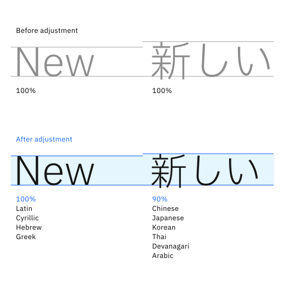
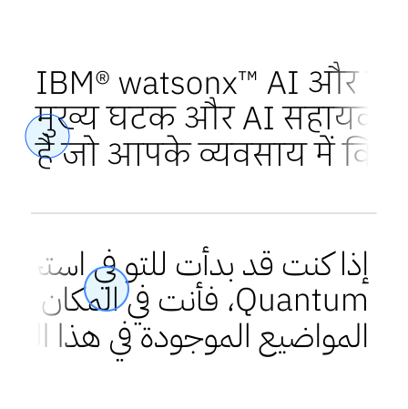

import { AnchorLinks, PageDescription, Video } from 'gatsby-theme-carbon';

import TypesetStyle from '../../components/TypesetStyle';
import TypeScaleTable from '../../components/TypeScaleTable';
import TypeTester from '../../components/TypeTester';
import TypeTesterSelect from '../../components/TypeTesterSelect';

<PageDescription>

Our corporate typeface, IBM Plex®, has its own set of guidance and best practices. Establishing a well-defined type scale is fundamental. It’s the foundation for maintaining consistency and visual coherence across all brand materials.

</PageDescription>

<AnchorLinks>
  <AnchorLink>Type scale equation</AnchorLink>
  <AnchorLink>Type scale</AnchorLink>
  <AnchorLink>Large formats</AnchorLink>
  <AnchorLink>Resources</AnchorLink>
</AnchorLinks>

## Type scale equation

The IBM type scale is built on a single equation. This equation establishes line heights so that the type is harmoniously spaced at all sizes. Because we’re a worldwide enterprise, all alphabets we use for content globalization are taken into account when considering type scales.

### Type scale formula

The formula for the our type scale equation was created to provide hierarchy for all kinds of experiences. The formula assumes that y₀=12px. There have been applications where a smaller scale was needed and created.

<div>

<TypeScaleTable />

```
Xn = Xn-1 + {INT[(n-2)/4] + 1} * 2
Xn: step n type size Xn-1: step n-1 type size
```

</div>

### Adjusted scale

While the default language for communication is US English, the IBM Plex font also has been created in multiple languages. Some alphabets have taller ascenders and longer descenders than others, necessitating an adjusted scale. Based on the particularities of each alphabet, we established two main categories.

#### Default scale
For Latin, Cyrillic, Hebrew and Greek experiences, use the IBM type scales.

#### Adjusted scale
For Chinese, Japanese, Korean, Thai, Devanagari and Arabic experiences, decrease the type’s point size to 95% while keeping the same line height as in the default scale.


<ArtDirection>




</ArtDirection>

<DoDontRow>
<DoDont type="dont" caption="Don’t use the default point size and line height for the Chinese, Japanese, Korean, Thai, Devanagari or Arabic alphabets. It can lead to letter overlaps or tight spacing." colLg="6">



</DoDont>
<DoDont caption="Decrease the point size to 95% when using the Chinese, Japanese, Korean, Thai, Devanagari or Arabic alphabet." colLg="6">


</DoDont>
</DoDontRow>

## Type scale

The universal type scale is the relationship between type sizes and corresponding line heights that’s used throughout our design systems. The IBM  line height adapts to the paragraph length and relative type size. The line height is usually larger for body type scales and becomes progressively tighter as the type size increases relative to the artboard. For certain type sizes, multiple line height options are provided to account for varying paragraph lengths and specific constraints.

Our existing templates use subsets of this scale. Make sure to use existing guidance and templates because they all draw from this universal scale.

<Row>
<Column colMd={4} colMd={8} colLg={12} noGutterSm>

<div className="table-header">
<div className="itens aligment-adjuster">
  <p><strong>Default scale</strong><br /> 
  Latin, Cyrillic, Hebrew, Greek</p>
</div>
<div className="itens">
  <p style={{marginLeft: '0.5rem'}} ><strong>Adjusted scale (95%)</strong><br />Chinese, Japanese, Korean, Thai, Devanagari, Arabic</p>
</div>
<div className="itens">
  <p style={{marginLeft: '1rem'}} ><strong>Line height</strong></p>
</div>
</div>

<div className="bx--col-lg-12 bx--col-no-gutter table-container">
    <table>
      <thead>
      </thead>
      <tbody>
        <tr>
          <td>6</td>
          <td>5,7</td>
          <td>8</td>
        </tr>
        <tr>
          <td>7</td>
          <td>6,65</td>
          <td>9</td>
        </tr>
        <tr>
          <td>9</td>
          <td>8,55</td>
          <td>12</td>
        </tr>
        <tr>
          <td>12</td>
          <td>11,4</td>
          <td>16</td>
        </tr>
        <tr>
          <td rowSpan={2}>14</td>
          <td rowSpan={2}>13,3</td>
          <td>18</td>
        </tr>
        <tr>
          <td>20</td>
        </tr>
        <tr>
          <td rowSpan={2}>16</td>
          <td rowSpan={2}>15,2</td>
          <td>22</td>
        </tr>
        <tr>
          <td>24</td>
        </tr>
        <tr>
          <td>18</td>
          <td>17,1</td>
          <td>24</td>
        </tr>
        <tr>
          <td rowSpan={2}>20</td>
          <td rowSpan={2}>19</td>
          <td>26</td>
        </tr>
        <tr>
          <td>28</td>
        </tr>
        <tr>
          <td rowSpan={2}>24</td>
          <td rowSpan={2}>22,8</td>
          <td>28</td>
        </tr>
        <tr>
          <td>30</td>
        </tr>
        <tr>
          <td>28</td>
          <td>26,6</td>
          <td>36</td>
        </tr>
        <tr>
          <td>32</td>
          <td>30,4</td>
          <td>40</td>
        </tr>
        <tr>
          <td>36</td>
          <td>34,2</td>
          <td>44</td>
        </tr>
        <tr>
          <td>42</td>
          <td>39,9</td>
          <td>50</td>
        </tr>
        <tr>
          <td>48</td>
          <td>45,6</td>
          <td>56</td>
        </tr>
        <tr>
          <td>54</td>
          <td>51,3</td>
          <td>64</td>
        </tr>
        <tr>
          <td>60</td>
          <td>57</td>
          <td>70</td>
        </tr>
        <tr>
          <td>68</td>
          <td>64,6</td>
          <td>78</td>
        </tr>
        <tr>
          <td>76</td>
          <td>72,2</td>
          <td>86</td>
        </tr>
        <tr>
          <td>84</td>
          <td>79,8</td>
          <td>94</td>
        </tr>
        <tr>
          <td>92</td>
          <td>87,4</td>
          <td>102</td>
        </tr>
        <tr>
          <td>102</td>
          <td>96,9</td>
          <td>114</td>
        </tr>
        <tr>
          <td>112</td>
          <td>106,4</td>
          <td>124</td>
        </tr>
        <tr>
          <td>122</td>
          <td>115,9</td>
          <td>130</td>
        </tr>
        <tr>
          <td>132</td>
          <td>125,4</td>
          <td>146</td>
        </tr>
        <tr>
          <td>144</td>
          <td>136,8</td>
          <td>160</td>
        </tr>
        <tr>
          <td>156</td>
          <td>148,2</td>
          <td>164</td>
        </tr>
        <tr>
          <td>168</td>
          <td>159,6</td>
          <td>186</td>
        </tr>
        <tr>
          <td>180</td>
          <td>171</td>
          <td>200</td>
        </tr>
        <tr>
          <td>194</td>
          <td>184,3</td>
          <td>216</td>
        </tr>
        <tr>
          <td>208</td>
          <td>197,6</td>
          <td>228</td>
        </tr>
        <tr>
          <td>222</td>
          <td>210,9</td>
          <td>244</td>
        </tr>
        <tr>
          <td>236</td>
          <td>224,2</td>
          <td>260</td>
        </tr>
        <tr>
          <td>252</td>
          <td>239,4</td>
          <td>276</td>
        </tr>
        <tr>
          <td>268</td>
          <td>254,6</td>
          <td>296</td>
        </tr>
        <tr>
          <td>284</td>
          <td>269,8</td>
          <td>312</td>
        </tr>
        <tr>
          <td>300</td>
          <td>285</td>
          <td>330</td>
        </tr>
      </tbody>
    </table>
  </div>
</Column>
</Row>

### Type tester

We’ve included a type tester so you can play with Plex® and explore the type scale in all styles, weights and languages. The typeface really comes to life once it’s set in words or paragraphs, so feel free to type away. You can select the weight and scale in the dropdowns. For Plex Chinese, Japanese, Korean, Thai, Devanagari and Arabic, the type scale has been adjusted to 95% of the default size while keeping the same line height.

<TypeTesterSelect />

## Large formats

The size of an artboard and the viewing distance influence how we perceive type. The larger and further away an asset is, the smaller the type appears. To counter this effect, we use a multiplication factor in our type scales for large formats that are to be viewed from a distance. Using this principle, the mini unit is also multiplied depending on the same factors—see the [Grid page](/2x-grid#base-unit) for more information. Note that these rules are valid as long as you are creating an asset at 100%. Extra scaling applies if you are designing at a different scale than 1:1.

#### Print

For print, the type scales were created for handheld print. When creating posters, signage and roll-up banners, depending on the viewing distance and size of the artboard, a multiplication factor should be used for both the point size and the line height. For example, for large posters and small signage such as easel signs, use 4x. For human-scale print experiences, such as roll-up banners and larger signage, use 8x. For print experiences viewed from across the street, use 32x.

#### Digital

Digital assets are created at a certain pixel size and often enlarged to be projected on larger screens. When creating assets on artboards up to 4K, use our type scales as given. However, when creating layouts directly at larger resolutions or on larger artboards, use a multiplication factor. For example, when creating designs at 8K, use 4x the type scales; when creating at 16K, use 8x, and so on.

<ArtDirection>


</ArtDirection>

#### Large formats type scale

There’s no need for you to do the math—we’ve provided the type scale for large formats shown here. Keep in mind the suggestion to decrease the size to 95% for Chinese, Japanese, Korean, Thai, Devanagari and Arabic to account for the specifics of those alphabets. Review [Adjusted scale](#adjusted-scale) for more information.

<Tabs>
  <Tab label="1x">

  <Row>
  <Column colMd={4} colMd={8} colLg={12} noGutterSm>
  <div class="bx--col-lg-12 bx--col-no-gutter">
    <div className="table-header">
      <div className="itens aligment-adjuster">
        <p><strong>Default scale</strong><br /> 
        Latin, Cyrillic, Hebrew, Greek</p>
      </div>
      <div className="itens">
        <p style={{marginLeft: '0.5rem'}}><strong>Adjusted scale (95%)</strong><br />Chinese, Japanese, Korean, Thai, Devanagari, Arabic</p>
      </div>
      <div className="itens">
        <p style={{marginLeft: '1rem'}} ><strong>Line height</strong></p>
      </div>
    </div>
    <div className="bx--col-lg-12 bx--col-no-gutter table-container">
      <table>
      <thead>
        <tr>
        </tr>
      </thead>
      <tbody>
        <tr>
          <td>6</td>
          <td>5,7</td>
          <td>8</td>
        </tr>
        <tr>
          <td>7</td>
          <td>6,65</td>
          <td>9</td>
        </tr>
        <tr>
          <td>9</td>
          <td>8,55</td>
          <td>12</td>
        </tr>
        <tr>
          <td>12</td>
          <td>11,4</td>
          <td>16</td>
        </tr>
        <tr>
          <td rowSpan={2}>14</td>
          <td rowSpan={2}>13,3</td>
          <td>18</td>
        </tr>
        <tr>
          <td>20</td>
        </tr>
        <tr>
          <td rowSpan={2}>16</td>
          <td rowSpan={2}>15,2</td>
          <td>22</td>
        </tr>
        <tr>
          <td>24</td>
        </tr>
        <tr>
          <td>18</td>
          <td>17,1</td>
          <td>24</td>
        </tr>
        <tr>
          <td rowSpan={2}>20</td>
          <td rowSpan={2}>19</td>
          <td>26</td>
        </tr>
        <tr>
          <td>28</td>
        </tr>
        <tr>
          <td rowSpan={2}>24</td>
          <td rowSpan={2}>22,8</td>
          <td>28</td>
        </tr>
        <tr>
          <td>30</td>
        </tr>
        <tr>
          <td>28</td>
          <td>26,6</td>
          <td>36</td>
        </tr>
        <tr>
          <td>32</td>
          <td>30,4</td>
          <td>40</td>
        </tr>
        <tr>
          <td>36</td>
          <td>34,2</td>
          <td>44</td>
        </tr>
        <tr>
          <td>42</td>
          <td>39,9</td>
          <td>50</td>
        </tr>
        <tr>
          <td>48</td>
          <td>45,6</td>
          <td>56</td>
        </tr>
        <tr>
          <td>54</td>
          <td>51,3</td>
          <td>64</td>
        </tr>
        <tr>
          <td>60</td>
          <td>57</td>
          <td>70</td>
        </tr>
        <tr>
          <td>68</td>
          <td>64,6</td>
          <td>78</td>
        </tr>
        <tr>
          <td>76</td>
          <td>72,2</td>
          <td>86</td>
        </tr>
        <tr>
          <td>84</td>
          <td>79,8</td>
          <td>94</td>
        </tr>
        <tr>
          <td>92</td>
          <td>87,4</td>
          <td>102</td>
        </tr>
        <tr>
          <td>102</td>
          <td>96,9</td>
          <td>114</td>
        </tr>
        <tr>
          <td>112</td>
          <td>106,4</td>
          <td>124</td>
        </tr>
        <tr>
          <td>122</td>
          <td>115,9</td>
          <td>130</td>
        </tr>
        <tr>
          <td>132</td>
          <td>125,4</td>
          <td>146</td>
        </tr>
        <tr>
          <td>144</td>
          <td>136,8</td>
          <td>160</td>
        </tr>
        <tr>
          <td>156</td>
          <td>148,2</td>
          <td>164</td>
        </tr>
        <tr>
          <td>168</td>
          <td>159,6</td>
          <td>186</td>
        </tr>
        <tr>
          <td>180</td>
          <td>171</td>
          <td>200</td>
        </tr>
        <tr>
          <td>194</td>
          <td>184,3</td>
          <td>216</td>
        </tr>
        <tr>
          <td>208</td>
          <td>197,6</td>
          <td>228</td>
        </tr>
        <tr>
          <td>222</td>
          <td>210,9</td>
          <td>244</td>
        </tr>
        <tr>
          <td>236</td>
          <td>224,2</td>
          <td>260</td>
        </tr>
        <tr>
          <td>252</td>
          <td>239,4</td>
          <td>276</td>
        </tr>
        <tr>
          <td>268</td>
          <td>254,6</td>
          <td>296</td>
        </tr>
        <tr>
          <td>284</td>
          <td>269,8</td>
          <td>312</td>
        </tr>
        <tr>
          <td>300</td>
          <td>285</td>
          <td>330</td>
        </tr>
      </tbody>
    </table>
  </div>
  </div>
   </Column>
  </Row>

  </Tab>
  <Tab label="4x">

  <Row>
  <Column colMd={4} colMd={8} colLg={12} noGutterSm>
  <div class="bx--col-lg-12 bx--col-no-gutter">
    <div className="table-header">
      <div className="itens aligment-adjuster">
        <p><strong>Default scale</strong><br /> 
        Latin, Cyrillic, Hebrew, Greek</p>
      </div>
      <div className="itens">
        <p style={{marginLeft: '0.5rem'}}><strong>Adjusted scale (95%)</strong><br />Chinese, Japanese, Korean, Thai, Devanagari, Arabic</p>
      </div>
      <div className="itens">
        <p style={{marginLeft: '1rem'}} ><strong>Line height</strong></p>
      </div>
    </div>
    <div className="bx--col-lg-12 bx--col-no-gutter table-container">
    <table>
      <thead>
        <tr>
        </tr>
      </thead>
      <tbody>
        <tr>
          <td>24</td>
          <td>22,8</td>
          <td>32</td>
        </tr>
        <tr>
          <td>28</td>
          <td>26,6</td>
          <td>36</td>
        </tr>
        <tr>
          <td>36</td>
          <td>34,2</td>
          <td>48</td>
        </tr>
        <tr>
          <td>48</td>
          <td>45,6</td>
          <td>64</td>
        </tr>
        <tr>
          <td rowSpan={2}>56</td>
          <td rowSpan={2}>53,2</td>
          <td>72</td>
        </tr>
        <tr>
          <td>80</td>
        </tr>
        <tr>
          <td rowSpan={2}>64</td>
          <td rowSpan={2}>60,8</td>
          <td>88</td>
        </tr>
        <tr>
          <td>96</td>
        </tr>
        <tr>
          <td>72</td>
          <td>68,4</td>
          <td>96</td>
        </tr>
        <tr>
          <td rowSpan={2}>80</td>
          <td rowSpan={2}>76</td>
          <td>104</td>
        </tr>
        <tr>
          <td>112</td>
        </tr>
        <tr>
          <td rowSpan={2}>96</td>
          <td rowSpan={2}>91,2</td>
          <td>112</td>
        </tr>
        <tr>
          <td>120</td>
        </tr>
        <tr>
          <td>112</td>
          <td>106,4</td>
          <td>144</td>
        </tr>
        <tr>
          <td>128</td>
          <td>121,6</td>
          <td>160</td>
        </tr>
        <tr>
          <td>144</td>
          <td>136,8</td>
          <td>176</td>
        </tr>
        <tr>
          <td>168</td>
          <td>159,6</td>
          <td>200</td>
        </tr>
        <tr>
          <td>192</td>
          <td>182,4</td>
          <td>224</td>
        </tr>
        <tr>
          <td>216</td>
          <td>205,2</td>
          <td>256</td>
        </tr>
        <tr>
          <td>240</td>
          <td>228</td>
          <td>280</td>
        </tr>
        <tr>
          <td>272</td>
          <td>258,4</td>
          <td>312</td>
        </tr>
        <tr>
          <td>304</td>
          <td>288,8</td>
          <td>344</td>
        </tr>
        <tr>
          <td>336</td>
          <td>319,2</td>
          <td>376</td>
        </tr>
        <tr>
          <td>368</td>
          <td>349,6</td>
          <td>408</td>
        </tr>
        <tr>
          <td>408</td>
          <td>387,6</td>
          <td>456</td>
        </tr>
        <tr>
          <td>448</td>
          <td>425,6</td>
          <td>496</td>
        </tr>
        <tr>
          <td>488</td>
          <td>463,6</td>
          <td>520</td>
        </tr>
        <tr>
          <td>528</td>
          <td>501,6</td>
          <td>584</td>
        </tr>
        <tr>
          <td>576</td>
          <td>547,2</td>
          <td>640</td>
        </tr>
        <tr>
          <td>624</td>
          <td>592,8</td>
          <td>656</td>
        </tr>
        <tr>
          <td>672</td>
          <td>638,4</td>
          <td>744</td>
        </tr>
        <tr>
          <td>720</td>
          <td>684</td>
          <td>800</td>
        </tr>
        <tr>
          <td>776</td>
          <td>737,2</td>
          <td>864</td>
        </tr>
        <tr>
          <td>832</td>
          <td>790,4</td>
          <td>912</td>
        </tr>
        <tr>
          <td>888</td>
          <td>843,6</td>
          <td>976</td>
        </tr>
        <tr>
          <td>944</td>
          <td>896,8</td>
          <td>1040</td>
        </tr>
        <tr>
          <td>1008</td>
          <td>957,6</td>
          <td>1104</td>
        </tr>
        <tr>
          <td>1072</td>
          <td>1018,4</td>
          <td>1184</td>
        </tr>
        <tr>
          <td>1072</td>
          <td>1018,4</td>
          <td>1184</td>
        </tr>
        <tr>
          <td>1136</td>
          <td>1079,2</td>
          <td>1248</td>
        </tr>
        <tr>
          <td>1200</td>
          <td>1140</td>
          <td>1320</td>
        </tr>
      </tbody>
    </table>
  </div>
  </div>
   </Column>
  </Row>

  </Tab>
  <Tab label="8x">

  <Row>
  <Column colMd={4} colMd={8} colLg={12} noGutterSm>
  <div class="bx--col-lg-12 bx--col-no-gutter">
    <div className="table-header">
      <div className="itens aligment-adjuster">
        <p><strong>Default scale</strong><br /> 
        Latin, Cyrillic, Hebrew, Greek</p>
      </div>
      <div className="itens">
        <p style={{marginLeft: '0.5rem'}}><strong>Adjusted scale (95%)</strong><br />Chinese, Japanese, Korean, Thai, Devanagari, Arabic</p>
      </div>
      <div className="itens">
        <p style={{marginLeft: '1rem'}}><strong>Line height</strong></p>
      </div>
    </div>
    <div className="bx--col-lg-12 bx--col-no-gutter table-container">
    <table>
      <thead>
        <tr>
        </tr>
      </thead>
      <tbody>
        <tr>
          <td>48</td>
          <td>45,6</td>
          <td>64</td>
        </tr>
        <tr>
          <td>56</td>
          <td>53,2</td>
          <td>72</td>
        </tr>
        <tr>
          <td>72</td>
          <td>68,4</td>
          <td>96</td>
        </tr>
        <tr>
          <td>96</td>
          <td>91,2</td>
          <td>128</td>
        </tr>
        <tr>
          <td rowSpan={2}>112</td>
          <td rowSpan={2}>106,4</td>
          <td>144</td>
        </tr>
        <tr>
          <td>160</td>
        </tr>
        <tr>
          <td rowSpan={2}>128</td>
          <td rowSpan={2}>121,6</td>
          <td>176</td>
        </tr>
        <tr>
          <td>192</td>
        </tr>
        <tr>
          <td>144</td>
          <td>136,8</td>
          <td>192</td>
        </tr>
        <tr>
          <td rowSpan={2}>160</td>
          <td rowSpan={2}>152</td>
          <td>208</td>
        </tr>
        <tr>
          <td>224</td>
        </tr>
        <tr>
          <td rowSpan={2}>192</td>
          <td rowSpan={2}>182,4</td>
          <td>224</td>
        </tr>
        <tr>
          <td>240</td>
        </tr>
        <tr>
          <td>224</td>
          <td>212,8</td>
          <td>288</td>
        </tr>
        <tr>
          <td>256</td>
          <td>243,2</td>
          <td>320</td>
        </tr>
        <tr>
          <td>288</td>
          <td>273,6</td>
          <td>352</td>
        </tr>
        <tr>
          <td>336</td>
          <td>319,2</td>
          <td>400</td>
        </tr>
        <tr>
          <td>384</td>
          <td>364,8</td>
          <td>448</td>
        </tr>
        <tr>
          <td>432</td>
          <td>410,4</td>
          <td>512</td>
        </tr>
        <tr>
          <td>480</td>
          <td>456</td>
          <td>560</td>
        </tr>
        <tr>
          <td>544</td>
          <td>516,8</td>
          <td>624</td>
        </tr>
        <tr>
          <td>608</td>
          <td>577,6</td>
          <td>688</td>
        </tr>
        <tr>
          <td>672</td>
          <td>638,4</td>
          <td>752</td>
        </tr>
        <tr>
          <td>736</td>
          <td>699,2</td>
          <td>816</td>
        </tr>
        <tr>
          <td>816</td>
          <td>775,2</td>
          <td>912</td>
        </tr>
        <tr>
          <td>896</td>
          <td>851,2</td>
          <td>992</td>
        </tr>
        <tr>
          <td>976</td>
          <td>927,2</td>
          <td>1040</td>
        </tr>
        <tr>
          <td>1056</td>
          <td>1003,2</td>
          <td>1168</td>
        </tr>
        <tr>
          <td>1152</td>
          <td>1094,4</td>
          <td>1280</td>
        </tr>
        <tr>
          <td>1248</td>
          <td>1185,6</td>
          <td>1312</td>
        </tr>
        <tr>
          <td>1344</td>
          <td>1276,8</td>
          <td>1488</td>
        </tr>
        <tr>
          <td>1440</td>
          <td>1368</td>
          <td>1600</td>
        </tr>
        <tr>
          <td>1552</td>
          <td>1474,4</td>
          <td>1728</td>
        </tr>
        <tr>
          <td>1664</td>
          <td>1580,8</td>
          <td>1824</td>
        </tr>
        <tr>
          <td>1776</td>
          <td>1687,2</td>
          <td>1952</td>
        </tr>
        <tr>
          <td>1888</td>
          <td>1793,6</td>
          <td>2080</td>
        </tr>
        <tr>
          <td>2016</td>
          <td>1915,2</td>
          <td>2208</td>
        </tr>
        <tr>
          <td>2144</td>
          <td>2036,8</td>
          <td>2368</td>
        </tr>
        <tr>
          <td>2272</td>
          <td>2158,4</td>
          <td>2496</td>
        </tr>
        <tr>
          <td>2400</td>
          <td>2280</td>
          <td>2640</td>
        </tr>
      </tbody>
    </table>
  </div>
  </div>
   </Column>
  </Row>

  </Tab>
</Tabs>

## Resources

IBM has established a universal type scale, containing a wide range of sizes. When designing, it’s important to use a curated type set for each specific use case. Embedded within many of our templates are various curated type sets, all part of IBM’s universal type scale. For example, you’ll want to use the Carbon type sets for product and web experiences, and use the collateral type sets for handheld print and corresponding PDFs, and so on.

<Row className="resource-card-group">
<Column colMd={4} colLg={4} noGutterSm>
  <ResourceCard
    subTitle="IBM Plex® typeface latest release"
    aspectRatio="2:1"
    href="https://github.com/IBM/plex/releases/latest"
    >


  </ResourceCard>
</Column>
<Column colMd={4} colLg={4} noGutterSm>
  <ResourceCard
    subTitle="Carbon type set"
    aspectRatio="2:1"         
    href="https://carbondesignsystem.com/elements/typography/type-sets"
    >


  </ResourceCard>
</Column>
<Column colMd={4} colLg={4} noGutterSm>
  <ResourceCard
    subTitle="Carbon v11 type set (Figma library)"
    aspectRatio="2:1"
    href="https://www.figma.com/file/rK06GY6bvEfokuzrFGdtWB/(v11)-Text-Styles---IBM-Design-Language?node-id=129%3A2"
    >


  </ResourceCard>
</Column>
</Row>
