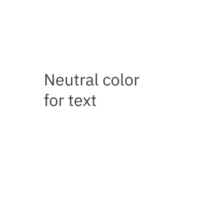
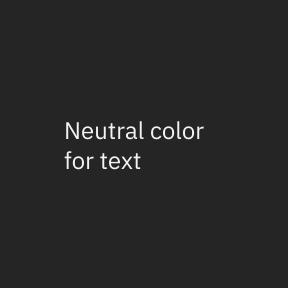
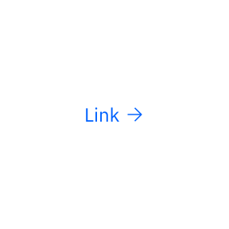
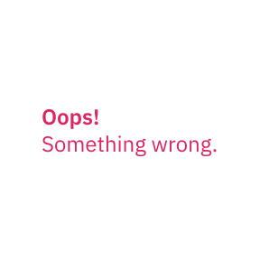
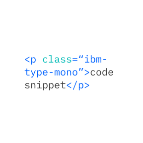

import { AnchorLinks, PageDescription, Video } from 'gatsby-theme-carbon';

import TypesetStyle from '../../components/TypesetStyle';
import TypeScaleTable from '../../components/TypeScaleTable';

import { noGutterSm } from '../../styles/Grid.module.scss';

<PageDescription>

Our bespoke corporate typeface, IBM Plex®, brings its own set of guidance and
best practices. Type specs help to set a starting point to apply typography—type
scales, styles and alignment on screens.

</PageDescription>

<AnchorLinks>
  <AnchorLink>Typeface</AnchorLink>
  <AnchorLink>Scales</AnchorLink>
  <AnchorLink>Style</AnchorLink>
  <AnchorLink>Fluid type</AnchorLink>
  <AnchorLink>Type set</AnchorLink>
  <AnchorLink>Type color</AnchorLink>
</AnchorLinks>

## Resources

<Row className="resource-card-group">
<Column colMd={4} colLg={4} noGutterSm>
  <ResourceCard
    subTitle="IBM Plex® latest typeface release"
    aspectRatio="2:1"
    href="https://github.com/IBM/plex/releases/latest"
    >


  </ResourceCard>
</Column>
<Column colMd={4} colLg={4} noGutterSm>
  <ResourceCard
    subTitle="IBM Design Language library"
    aspectRatio="2:1"
    href="sketch://add-library/cloud/nwqmk"
    >


  </ResourceCard>
</Column>
</Row>

## Typeface

The IBM Plex® family comes in sans, serif, condensed and monospaced versions to
serve a variety of needs across all experiences. It has been specifically
designed to work well in digital environments and small or large scales. It
comes in extended Latin and non-Latin scripts. See the
[Typeface](/typography/typeface) page to learn more.

<div>

<Row>
<Column className="no-gap" colLg={8} noGutterSm>

<div class="typeface">

<span class="bx--type">IBM Plex Sans</span>
<span class="bx--type-serif">IBM Plex Serif</span>
<span class="bx--type-mono">IBM Plex Mono</span>
<span class="bx--type-condensed">IBM Plex Condensed</span>

</div>

</Column>
</Row>

```html
<span class="bx--type">IBM Plex Sans</span>
<span class="bx--type-serif">IBM Plex Serif</span>
<span class="bx--type-mono">IBM Plex Mono</span>
<span class="bx--type-condensed">IBM Plex Condensed</span>
```

</div>

## Scales

The IBM type scale is built on a single equation. The formula for our scale was
created to provide hierarchy for all types of experiences. The formula assumes
that y₀=12px.

<div>

<TypeScaleTable />

```
Xn = Xn-1 + {INT[(n-2)/4] + 1} * 2
Xn: step n type size Xn-1: step n-1 type size
```

</div>

## Style

Typography creates purposeful texture. It guides users to read and understand
the hierarchy of information. The right typographic treatment and the controlled
usage of type styles helps manage the display of content, keeping it useful,
simple and effective.

### Weights

We suggest use of IBM Plex Light, Regular, and Semibold for digital experiences.
The semibold weight is ideal for section headers, but should not be used for
long text.

<div>
  
<Row>
<Column className="no-gap" colLg={8} noGutterSm>

<div class="type-weight">

<span class="bx--type-semibold">Semibold</span>
<span class="bx--type-regular">Regular</span>
<span class="bx--type-light">Light</span>

</div>

</Column>
</Row>

```html
<span class="bx--type-semibold">Semibold</span>
<span class="bx--type-regular">Regular</span>
<span class="bx--type-light">Light</span>
```

</div>

### Italic

Each weight has an Italic style, which should only be used when you need to
emphasize certain words in a sentence (titles of works, technical terms, names
of devices, captions).

<div>

<Row>
<Column className="no-gap" colLg={8} noGutterSm>

<div class="type-weight">

<span class="bx--type-semibold bx--type-italic">Semibold</span>
<span class="bx--type-regular bx--type-italic">Regular</span>
<span class="bx--type-light bx--type-italic">Light</span>

</div>

</Column>
</Row>

```html
<span class="bx--type-semibold bx--type-italic">Semibold</span>
<span class="bx--type-regular bx--type-italic">Regular</span>
<span class="bx--type-light bx--type-italic">Light</span>
```

</div>

## Fluid type

To create a better experience along with our fluid grid, fluid type is an option
for large display type. We set up our fixed type scales for the breakpoints and
have them being fluid in between. This helps us to maintain the quality of
typography.

<Video
  src="/videos/type-specs-fluid-type.mp4"
  poster="/images/type-specs-fluid-type.jpg"
/>

## Type set

Even though IBM Plex contains a wide range of scales, it’s important to use a
curated type set. For a clear and focused reading experience, consider content
needs and how type works across various screen sizes. The IBM type set includes
a Productive set designed primarily for product use and an Expressive set which
adds a series scales and fluid behavior.

<TypesetStyle
  title="Productive"
  breakpointControls={false}
  typesets="supportingStyle,body,fixedHeading"
/>

<TypesetStyle
  title="Expressive"
  breakpointControls={true}
  typesets="fluidHeadings,FluidParagraphsAndQuotes,fluidDisplay"
/>

## Type color

Careful consideration of color maintains quality and recognition for users.
Legibility and accessibility are two keys. Keep colored type neutral when in
paragraphs. Use primary blue for primary actions.

<DoDontRow>
<DoDont>



</DoDont>
<DoDont type="dont">


</DoDont>
</DoDontRow>

<DoDontRow>
<DoDont color="dark">



</DoDont>
<DoDont type="dont" color="dark">


</DoDont>
</DoDontRow>

<DoDontRow>
<DoDont caption="Core blue colors are used for text links and primary actions.">



</DoDont>
<DoDont caption="Secondary actions use gray 100 and icons.">


</DoDont>
</DoDontRow>

<DoDontRow>
<DoDont caption="Other use cases for colored type are code snippets, warnings, alerts, etc.">



</DoDont>
<DoDont>



</DoDont>
</DoDontRow>
