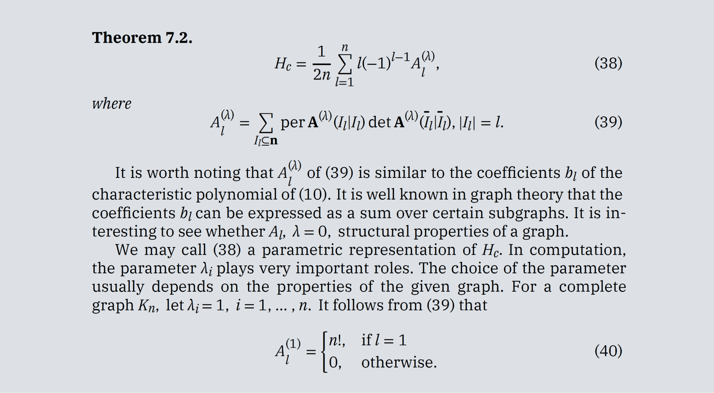

import TypefaceSubFamilies from '../../components/TypeFaceSubFamilies';
import TypeTester from '../../components/TypeTester';
import NonLatinScripts from '../../components/NonLatinScripts';

import { noGutterSm } from '../../styles/Grid.module.scss';
import v337384869 from '../../videos/vimeo/337384869.mp4';
import p337384869 from '../../videos/vimeo/337384869.jpg';

<PageDescription>

IBM Plex® is our corporate typeface. It has been carefully designed to meet
our needs as a global technology company and reflect our brand spirit, beliefs
and design principles.

</PageDescription>

<AnchorLinks>
  <AnchorLink>Our typeface</AnchorLink>
  <AnchorLink>Subfamilies</AnchorLink>
  <AnchorLink>Type tester</AnchorLink>
  <AnchorLink>Typeface features</AnchorLink>
  <AnchorLink>Mono versus sans</AnchorLink>
  <AnchorLink>Language support</AnchorLink>
  <AnchorLink>Non-Latin scripts</AnchorLink>
  <AnchorLink>IBM Plex Math</AnchorLink>
  <AnchorLink>Open-source licenses</AnchorLink>
  <AnchorLink>Where else to get Plex®</AnchorLink>
  <AnchorLink>Design team</AnchorLink>
  <AnchorLink>Awards</AnchorLink>
  <AnchorLink>Feedback and questions</AnchorLink>
</AnchorLinks>

<video src={v337384869} controls preload="metadata" style={{width: "100%"}} poster={p337384869} />

## Resources

<Row className="resource-card-group">
<Column colMd={4} colLg={4} noGutterSm>
    <ResourceCard
      subTitle="IBM Plex® typeface latest release"
      aspectRatio="2:1"
      href="https://github.com/IBM/plex/releases/latest"
      >

  </ResourceCard>
</Column>
<Column colMd={4} colLg={4} noGutterSm>
    <ResourceCard
      subTitle="IBM Plex® website"
      aspectRatio="2:1"
      href="https://www.ibm.com/plex/"
      >

  </ResourceCard>
</Column>
</Row>

## Our typeface

As the patented typeface for our diverse and global brand, IBM Plex is just as
important as our name or our logo. It fine-tunes the tone of our words. It
represents who we are and what we believe—as a company and as designers. Every
decision is made with purpose; every detail has a reason for being.

<Video
  src="/videos/typeface_02.mp4"
  poster="/images/TypefaceSecondVideoPoster.gif"
/>

## Subfamilies

With four subfamilies, eight weights and two styles (roman and italic), IBM
Plex can do just about anything you need it to. Just download the latest from
[GitHub](https://github.com/IBM/plex/releases/latest), add to your font manager,
activate and enjoy. To learn more, with a deep dive into details and the story,
visit the [Plex](https://www.ibm.com/plex/) website.

<TypefaceSubFamilies />

## Type tester

We’ve included the type tester so you can play with Plex and explore all its
styles, weights and languages. The typeface really comes to life once it’s set
in words or paragraphs, so feel free to type away.

<TypeTester />

## Typeface features

IBM Plex comes with some additional basic features, such as ligatures across Sans and Serif, as well as fractions, arrows, alternate glyphs and global currency
symbols. These elements can be accessed through OpenType features and glyph palettes in the available standard design tools. Get the latest
[Plex](https://github.com/IBM/plex/releases/latest).

<Row className="image-grid">
<Column colMd={4} colLg={4}>

</Column>
<Column colMd={4} colLg={4} >

</Column>
<Column colMd={4} colLg={4} >

</Column>

<Column colMd={4} colLg={4}>

</Column>
<Column colMd={4} colLg={4}>

</Column>
<Column colMd={4} colLg={4}>

</Column>
</Row>

## Mono versus sans

The monospaced version of IBM Plex is especially designed to fit every glyph into a 600 unit space, which takes its cues from the typewriter era. Monospaced fonts are used for coding by developers and should also be used to demonstrate code snippets in our communications and specifications.

## Language support

IBM Plex covers over 100 languages with extended Latin versions. These languages cover the
typographic needs for executing communications and other typographic situations
across the international community. All four subfamilies are covered in the
extended Latin, which includes Vietnamese. In addition, Plex covers a growing set
of non-Latin scripts which currently include Arabic, Chinese, Cyrillic, Devanagari,
Greek, Hebrew, Japanese, Korean and Thai.

<Row className="mobile-columns">
<Column className="one" colSm={2} colMd={2} colLg={3}>

Afrikaans Albanian Arabic Arabic Afrikaans Arwi (Arabic Tamil) Asu Äynu Azerbaijani Bakhtiari Balti Balochi/Baluchi Basque 
Beja Belarusian Bemba Bena Bokmål Bosnian Brahui Breton Bru Bulgarian Catalan
Central Chagatai Chinese (Traditional) Chinese (Simplified) Chiga Chong Comorian Coptic Cornish Croatian Czech Danish Dari 
Deccani Devanagari Dogri Domari Dutch Eastern
Cham Embu English Esperanto 
Estonian Faroese 

</Column>
<Column className="two" colSm={2} colMd={2} colLg={3}>

Farsi Filipino Finnish French Galician Ganda German Gilaki Greek Gujari Gusii Hausa Hawaiian 
Hazaragi Hebrew Hindko Hungarian Icelandic Indonesian Indus Ingush 
Irish Italian Japanese Jola-Fonyi Kabuverdianu Kachi
Koli Kalaallisut Kalenjin Kamba 
Kanuri Karakalpak Kashmiri/ Kazakh Khowar Kikuyu Kinyarwanda Kohistani Korean Kurdish Kuy Kyrgyz Lahnda Laki 
Latvian

</Column>
<Column className="three" colSm={2} colMd={2} colLg={3}>

Lithuanian Luhya Lwalu Macedonian Machame Makhuwa-Meetto Makonde Malagasy Malay Maltese Manx Mazanderani Meru Mongolian Morisien Moroccan
Arabic Muslim Tat Northern Hindko  Northern Khmer Northern
Luri Ndebele Norwegian Nyah
Kur Nyankole Nynorsk Oromo  Ottoman
Turkish Pali Parkari Koli Parsi-Dari Pashto Patani
Malay Polish 
Portuguese Punjabi Qashqai Romanian Romansh Rombo Rundi Russian Rwa Samburu Sango Sangu

</Column>
<Column className="four" colSm={2} colMd={2} colLg={3}>

Sanskrit Sena Serbian Seraiki Serer Shambala Shona Sindhi Slovak Slovenian So Soga Somali South
Azerbaijani Southern Hindko Southern Kurdish Southern
Luri Spanish Susu Swahili Swedish  Swiss
German Tachelhit Taita Tajik Talysh Teso Thai Tongan Turkish Turkmen 
Ukrainian Urdu Uyghur Uzbek Vietnamese Vunjo Wadiyara
Koli Western Cham Wolof Welsh  Zoroastrian Zulu

</Column>
</Row>

## Non-Latin scripts

Global languages are part of the long-term plan for the IBM Plex typeface family. Non-Latin language designs are currently in development. The available non-Latin languages are shown here along with what’s also in the pipeline.

<NonLatinScripts />

## IBM Plex Math

IBM Plex® Math includes over 5,000 new glyphs, covering a wide range of mathematical symbols, such as alphanumeric, double-struck, Mono Fraktur, operators and script, as well as icons, arrows, Greek letters, phonetics, and technical and geometric shapes. It’s one of the most complete math fonts available today. Its compatibility with IBM Plex® Serif Regular makes it an ideal choice for IBM researchers and mathematicians. _Note: Plex® Math must be used with LaTeX software or an equivalent to format or typeset math equations in text documents._

<Caption>Sample paper for the amsmath package. File name: testmath.tex
American Mathematical Society, Version 2.0, 1999/11/15</Caption>

<Row className="resource-card-group">
<Column colMd={4} colLg={4} noGutterSm>
    <ResourceCard
      subTitle="IBM Plex Math"
      aspectRatio="2:1"
      href="https://github.com/IBM/plex/releases/tag/%40ibm%2Fplex-math%401.0.0"
      >

  </ResourceCard>
</Column>
</Row>

## Open-source licenses

The IBM Plex design has been awarded a patent and is the intellectual property of IBM. The basic Open Font License (OFL) can be found in the downloadable font files. If alternative licensing is needed when embedding or bundling IBM Plex into software packages, contact the appropriate legal teams.

## Where else to get Plex®

Because Plex is open source, we felt it was important to include it in the Google Fonts and Adobe Fonts libraries to make it available for anyone to use. However, the fonts in these libraries may not have the latest versions, so we always recommend going to the [IBM Plex GitHub](https://github.com/IBM/plex/releases/latest) repo.

<Row className="resource-card-group">
<Column colMd={4} colLg={4} noGutterSm>
    <ResourceCard
      subTitle="IBM Plex® on Google Fonts"
      aspectRatio="2:1"
      href="https://fonts.google.com/?query=ibm+plex"
      >

  </ResourceCard>
</Column>
<Column colMd={4} colLg={4} noGutterSm>
    <ResourceCard
      subTitle="IBM Plex® on Adobe Fonts"
      aspectRatio="2:1"
      href="https://fonts.adobe.com/foundries/ibm"
      >

  </ResourceCard>
</Column>
</Row>

## Design team

The IBM Plex team is a world-class group of type design experts, hailing from
Austria, China, Croatia, Israel, Japan, Korea, Latvia, Poland, Lebanon, the
Netherlands, Romania, Spain, Switzerland, the United Kingdom and the United
States. As the non-Latin variations grow more, so will our international team of
type designers.

## Awards

Recently, IBM Plex Sans and Mono were acquired into the permanent collection of the [Cooper Hewitt, Smithsonian Design Museum](https://www.cooperhewitt.org/) in New York City. IBM Plex has gained recognition in the international type design community and has won various international competitions. Plex received its first international recognition in the Type Directors Club Competition, [TDC 64 2018](https://tdc.org/competitions/typeface-design-2018/?judges-choice=on#filters-section), where it won the Judge’s Choice for Typographic Excellence. In 2020, IBM Plex Sans Arabic was honored with a Pencil Award in the Type Design category at the prestigious [D&AD Awards](https://www.dandad.org/awards/professional/2020/232950/ibm-plex-arabic/). Plex has also been granted several international patents.

## Feedback and questions

Address all inquiries or issues on
[GitHub](https://github.com/ibm/plex/issues) and be sure to download the latest versions
[here](https://github.com/IBM/plex/releases/latest).
