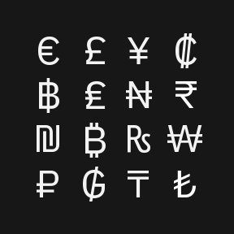

import TypefaceSubFamilies from '../../components/TypeFaceSubFamilies';
import TypeTester from '../../components/TypeTester';
import NonLatinScripts from '../../components/NonLatinScripts';

import { noGutterSm } from '../../styles/Grid.module.scss';

<PageDescription>

IBM Plex® is our new corporate typeface. It has been carefully designed to meet
our needs as a global technology company and reflect our brand spirit, beliefs
and design principles.

</PageDescription>

<AnchorLinks>
  <AnchorLink>Our typeface</AnchorLink>
  <AnchorLink>Subfamilies</AnchorLink>
  <AnchorLink>Type tester</AnchorLink>
  <AnchorLink>Typeface features</AnchorLink>
  <AnchorLink>Mono vs. sans</AnchorLink>
  <AnchorLink>Language support</AnchorLink>
  <AnchorLink>Non-Latin scripts</AnchorLink>
  <AnchorLink>Open source licenses</AnchorLink>
  <AnchorLink>Where else to get Plex</AnchorLink>
  <AnchorLink>Feedback and questions</AnchorLink>
</AnchorLinks>

<Video vimeoId="337384869" />

## Resources

<Row className="resource-card-group">
<Column colMd={4} colLg={4} noGutterSm>
    <ResourceCard
      subTitle="IBM Plex® latest typeface version"
      aspectRatio="2:1"
      href="https://github.com/IBM/plex/releases/latest"
      >

  </ResourceCard>
</Column>
<Column colMd={4} colLg={4} noGutterSm>
    <ResourceCard
      subTitle="IBM Plex® website"
      aspectRatio="2:1"
      href="https://www.ibm.com/plex/"
      >

  </ResourceCard>
</Column>
</Row>

## Our typeface

As the patented typeface for our diverse and global brand, IBM Plex is just as
important as our name or our logo. It fine-tunes the tone of our words. It
represents who we are and what we believe—as a company and as designers. Every
decision is made with purpose; every detail has a reason for being.

<Video
  src="/videos/typeface_02.mp4"
  poster="/images/TypefaceSecondVideoPoster.gif"
/>

## Subfamilies

With four subfamilies, eight weight and and two styles (roman and italic), IBM
Plex can do just about anything you need it to. Just download the latest from
[GitHub](https://github.com/IBM/plex/releases/latest), add to your font manager,
activate and enjoy. To learn more with a deep dive into details and the story,
visit the [Plex](https://www.ibm.com/plex/) website.

<TypefaceSubFamilies />

## Type tester

We’ve included the type tester so you can play with Plex and explore all its
styles, weights and languages. The typeface really comes to life once it’s set
in words or paragraphs, so feel free to type away!

<TypeTester />

## Typeface features

IBM Plex comes with some additional basic features like ligatures across Sans
and Serif as well as fractions, arrows, alternate glyphs and global currency
symbols. These can be accessed through OpenType features and glyph palettes in
the standard design tools available. Get the latest
[Plex](https://github.com/IBM/plex/releases/latest).

<Row className="image-grid">
<Column colMd={4} colLg={4}>

</Column>
<Column colMd={4} colLg={4} >

</Column>
<Column colMd={4} colLg={4} >

</Column>

<Column colMd={4} colLg={4}>

</Column>
<Column colMd={4} colLg={4}>

</Column>
<Column colMd={4} colLg={4}>

</Column>
</Row>

## Mono vs. sans

The monospaced version of IBM Plex is especially designed to fit every glyph
into a 600 unit space which takes its cues from the typewriter era. Monospaced
fonts are used for coding by developers and should also be used to demonstrate
code snippets in our communications and specifications.

## Language support

IBM Plex covers over 100 languages with extended Latin versions. These cover the
typographic needs for executing communications and other typographic situations
across the international community. All four sub-families are covered in the
extended Latin which includes Vietnamese. In addition Plex covers a growing set
of non-Latin scripts which currently include Arabic, Cyrillic, Devanagari,
Greek, Hebrew, Korean and Thai.

<Row className="mobile-columns">
<Column className="one" colSm={2} colMd={2} colLg={3}>

Afrikaans Albanian Arabic Asu Azerbaijani Bakhtiari Balti Balochi Basque 
Beja Belarusian Bemba Bena Bokmål Bosnian Brahui Breton Bru Bulgarian Catalan
Central Chiga Chong Comorian Coptic Cornish Croatian Czech Danish Dari 
Deccani Devanagari Dogri Domari Dutch Eastern
Cham Embu English Esperanto 
Estonian Faroese Filipino Finnish

</Column>
<Column className="two" colSm={2} colMd={2} colLg={3}>

French Galician Ganda German Gilaki Greek Gujari Gusii Hausa Hawaiian 
Hazaragi Hebrew Hindko Hungarian Icelandic Indonesian Indus Ingush 
Irish Italian Jola-Fonyi Kabuverdianu Kachi Koli Kalaallisut Kalenjin Kamba 
Kanuri Kashmiri Kazakh Khowar Kikuyu Kinyarwanda Kohistani Korean Kurdish Kuy Kyrgyz Lahnda Laki 
Latvian Lithuanian Luhya

</Column>
<Column className="three" colSm={2} colMd={2} colLg={3}>

Lwalu Macedonian Machame Makhuwa-Meetto Makonde Malagasy Malay Maltese Manx Mazanderani Meru Mongolian Morisien Moroccan
Arabic Muslim Tat Northern Hindko  Northern Khmer Northern
Luri Ndebele Norwegian Nyah
Kur Nyankole Nynorsk Oromo  Ottoman
Turkish Pali Parkari Koli Parsi-Dari Pashto Patani
Malay Polish 
Portuguese Punjabi Romanian Romansh Rombo Rundi Russian Rwa Samburu Sango Sangu

</Column>
<Column className="four" colSm={2} colMd={2} colLg={3}>

Sanskrit Sena Serbian Seraiki Shambala Shona Sindhi Slovak Slovenian So Soga Somali South
Azerbaijani Southern Hindko Southern Kurdish Southern
Luri Spanish Susu Swahili Swedish  Swiss
German Tachelhit Taita Tajik Talysh Teso Thai Tongan Turkish Turkmen 
Ukrainian Uyghur Uzbek Vietnamese Vunjo Wadiyara
Koli Western Cham Wolof Welsh  Zoroastrian Zulu

</Column>
</Row>

## Non-Latin scripts

Global languages are part of the long-term plan for the IBM Plex typeface
family. Non-Latin language designs are currently in development. The available
non-Latin are shown below with what’s also in the pipeline.

<NonLatinScripts />

### Asian scripts

The Chinese and Japanese scripts are currently under development. Japanese is
scheduled for release in early 2021 and Chinese will have a staggered release
due to the scale of the project. We will be supporting both Traditional and
Simplified Chinese. In the meantime, we have chosen open source Chinese and
Japanese typefaces that can work well with the IBM Plex Family.

<Row className="resource-card-group">
<Column colMd={4} colLg={4} noGutterSm>
    <ResourceCard
      subTitle="Simplified Chinese Noto Sans CJK SC"
      aspectRatio="2:1"
      href="https://www.google.com/get/noto/#sans-hans"
      >

  </ResourceCard>
</Column>
<Column colMd={4} colLg={4} noGutterSm>
    <ResourceCard
      subTitle="Traditional Chinese Noto Sans CJK TC"
      aspectRatio="2:1"
      href="https://www.google.com/get/noto/#sans-hant"
      >

  </ResourceCard>
</Column>
<Column colMd={4} colLg={4} noGutterSm>
    <ResourceCard
      subTitle="Japanese Noto Sans JP"
      aspectRatio="2:1"
      href="https://fonts.google.com/specimen/Noto+Sans+JP"
      >

  </ResourceCard>
</Column>
</Row>

## Open source licenses

IBM Plex design has been awarded a patent and is the intellectual property of
IBM. The basic OFL License can be found in the downloadable font files. If
alternative licensing is needed when embedding or bundling IBM Plex into
software packages, please contact the appropriate legal teams.

## Where else to get Plex

Because Plex is open source we felt it was important to include it in the Google
Fonts and Adobe Typekit Libraries to help make it available for all people to
use. However, the fonts in these libraries may not have the latest versions so
we always recommend going to the
[IBM Plex GitHub](https://github.com/IBM/plex/releases/latest) repo.

<Row className="resource-card-group">
<Column colMd={4} colLg={4} noGutterSm>
    <ResourceCard
      subTitle="IBM Plex® on Google Fonts"
      aspectRatio="2:1"
      href="https://fonts.google.com/?query=ibm+plex"
      >

  </ResourceCard>
</Column>
<Column colMd={4} colLg={4} noGutterSm>
    <ResourceCard
      subTitle="IBM Plex® on Adobe Typekit"
      aspectRatio="2:1"
      href="https://typekit.com/foundries/ibm"
      >

  </ResourceCard>
</Column>
</Row>

## Design team

The IBM Plex team is a world-class group of type design experts hailing from
Austria, China, Croatia, Israel, Japan, Korea, Latvia, Poland, Lebanon, the
Netherlands, Romania, Spain, Switzerland, the United Kingdom, and the United
States. As the non-Latin variations grow more, so will our international team of
type designers.

## Plex merchandise

The [IBM Store](https://logostore-globalid.us/productlist.aspx?did=28168) has an
exclusive collection of Plex merchandise ranging from a coffee mug, cool tees
and totes. Please check out the collection and let us know what you think. We
will be updating the designs periodically to keep them fresh, fun and
expressive.

## Awards

Soon after the release, IBM Plex (Latin) won recognition in an international
competition by the Type Directors Club in
[TDC 64 2018](https://www.tdc.org/competitions/typeface-design-2018/?judges-choice=on#filters-section).
Plex took away a judge's choice award for typographic excellence. Let’s see how
the non-Latin scripts do as we develop them and also submit to more global
competitions. Plex has also been awarded several international patents.

## Feedback and questions

Please address all inquiries or issues on
[GitHub](https://github.com/ibm/plex/issues) and be sure to download the latest
[here](https://github.com/IBM/plex/releases/latest).
