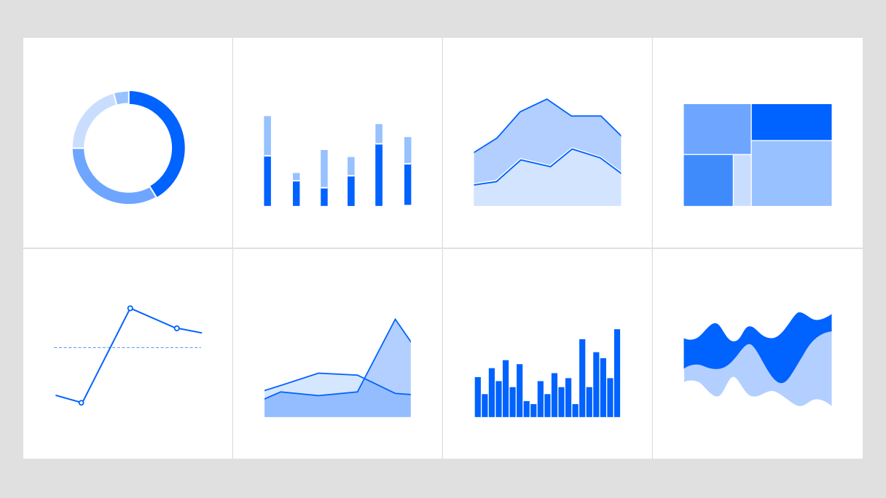
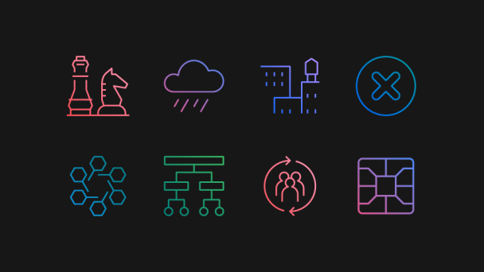
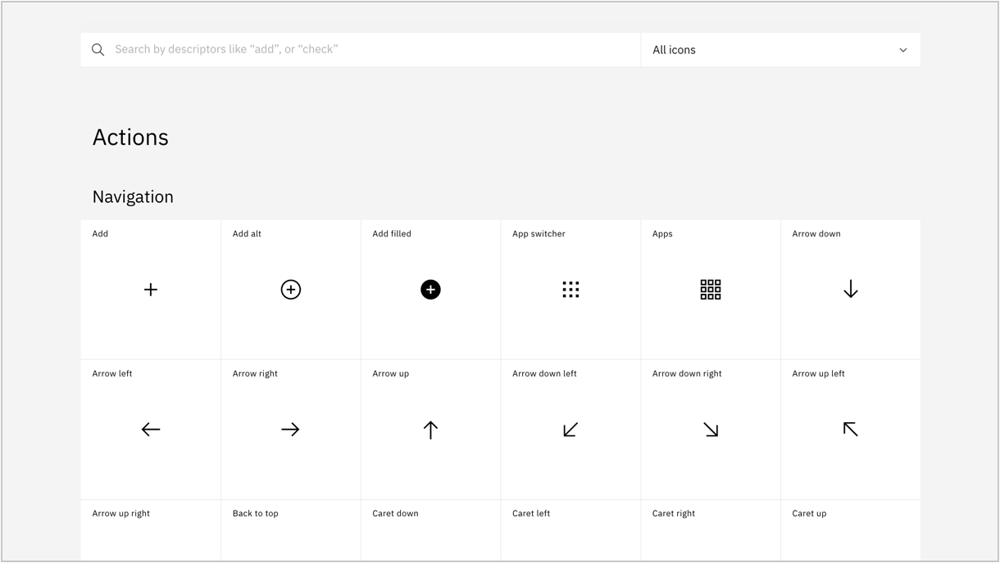

import { PageDescription, AnchorLinks, AnchorLink } from 'gatsby-theme-carbon';

<PageDescription>

The IBM Design Language guidance, assets, and site experience are constantly evolving and improving. This page lists all major updates, changes, rollouts and release dates. Check back here to learn what’s new in the latest release.

</PageDescription>

## Data visualization guidance

<Row>
<Column colMd={6} colLg={8}>

</Column>
</Row>

Usable data is a central value IBM provides to our customers. Accurate, understandable data visualization relies on clarity delivered through typography using visual models that employ structure, contrast and rhythm. Consistency in style and scale provides user confidence in the integrity of data. Context maximizes the environmental constraints to enhance audience comprehension of the data. Now the IBM Design Language provides a distinctive rationale for visual representation of the IBM brand. Use this new guidance to create on-brand [data visualization] (https://www.ibm.com/design/language/datavisualization/overview) with impact. —  5 March, 2020

## IBM stationery system

<Row>
<Column colMd={6} colLg={8}>

</Column>
</Row>

The [IBM stationery](https://www.ibm.com/brand/stationery) system has been redesigned to be a modern statement of our brand expression. The new business card is one universal size on your choice of blue or white card stock and provides the flexibility to use multiple languages or social media handles. The letterhead, envelopes and mailing labels are available in US and ISO sizes with shipping envelopes. A phased rollout to markets worldwide begins Q1 2020 and into 2021. Learn more and check the [schedule](https://www.ibm.com/brand/stationery#rollout-schedule) for availability and adhere to purchasing policies for your business unit and market. —  13 February, 2020

## Pictogram library

<Row>
<Column colMd={6} colLg={8}>

</Column>
</Row>

We have a new library with over 400 pictograms available to use and even more to come in the next release. Along with the library comes an [.ai master file](https://github.com/carbon-design-system/carbon/raw/master/packages/pictograms/master/pictogram-master.ai) with all the pictograms organized by category. This library and master file will serve as the single source of truth representing the latest and approved pictograms. If you need pictograms or want to contribute, please follow the guidance outlines [here](.https://www.ibm.com/design/language/elements/pictograms/contribute) and check out the [library](.https://www.ibm.com/design/language/elements/pictogram-library/). —  9 October, 2019

## Search and filtering

<Row>
<Column colMd={6} colLg={8}>

</Column>
</Row>

This cycle, we released a major enhancement to our [UI Icon](https://www.ibm.com/design/language/iconography/ui-icons/library) and [Pictogram](https://www.ibm.com/design/language/iconography/ui-icons/library) libraries by adding search and category filtering, making it much easier to find what you’re looking for!  —  9 October, 2019

## Color palette V2

<Row>
<Column colMd={6} colLg={8}>

</Column>
</Row>

We’re pleased to announce the new IBM Design Language [V2 color palette](https://www.ibm.com/design/language/color/). The updates from V1 are quite subtle at first glance but incorporate significant refinements when considering contrast ratios and accessibility for digital screens and interfaces. For an in-depth article outlining the methodology and process please visit [Because, colors are beautiful](.https://medium.com/carbondesign/because-colors-are-beautiful-52dd4cc39f09).

**Updates** 
- 3:1 contrast ratio between 60/90
- 4.5:1 contrast ratio between 50/90, 40/80, 30/70, 20/60
- slight hue enhancements to the magentas to be more distinct from the reds
- hues across each color have been smoothed out for more consistency
- contrast ratios have been refined for a smoother curve

— 25 September, 2019
