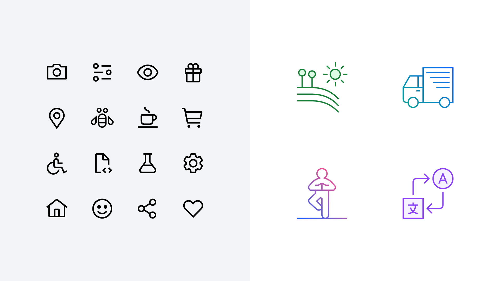
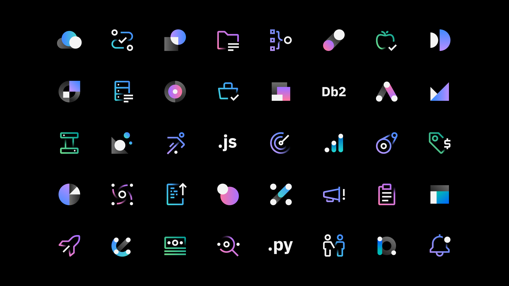
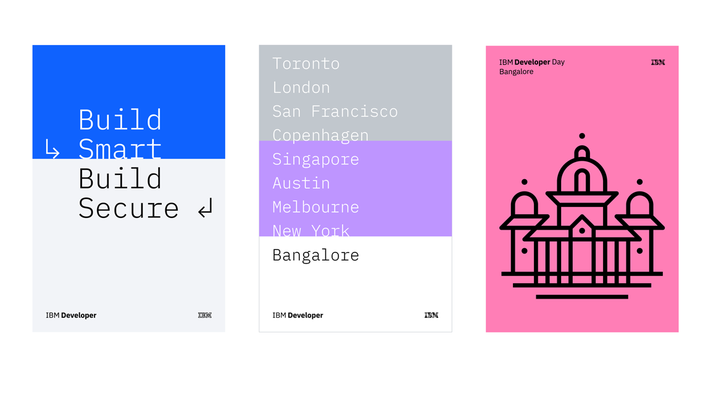
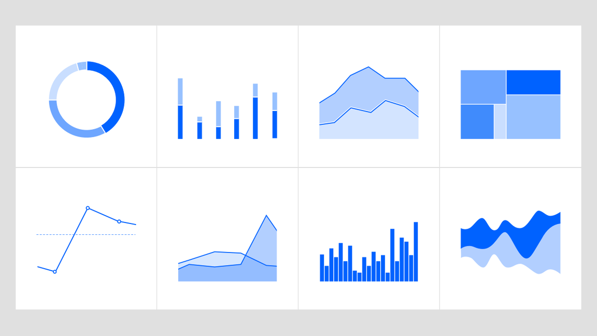
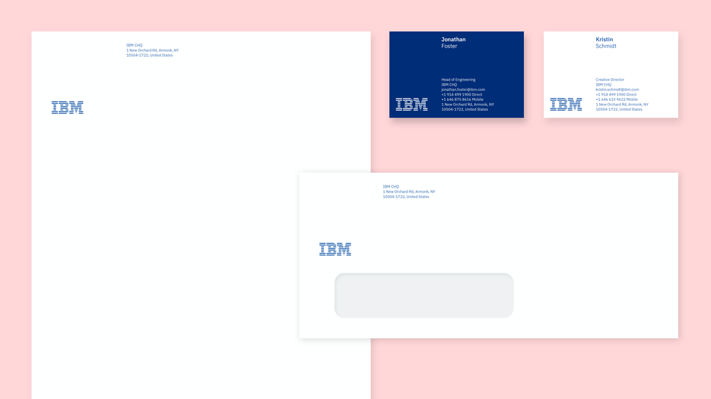
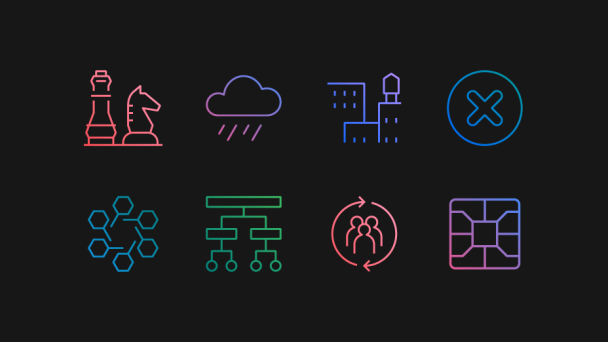
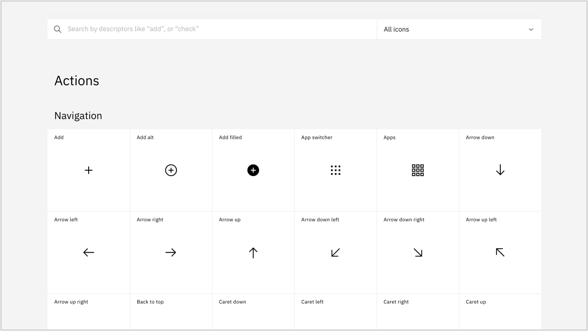

import { PageDescription, AnchorLinks, AnchorLink } from 'gatsby-theme-carbon';
import { gridImages } from '../../styles/Grid.module.scss';

<PageDescription>

The IBM Design Language guidance, assets, and site experience are constantly
evolving and improving. This page lists all major updates, changes, rollouts and
release dates. Check back here to learn what’s new in the latest release.

</PageDescription>

## Iconography contributions

<Row>
<Column colLg={8} colMd={6}>

</Column>
</Row>

The IBM Design Language now has over 500 [pictograms](https://www.ibm.com/design/language/iconography/pictograms/library) and 1,000 [UI icons](https://www.ibm.com/design/language/iconography/ui-icons/library) available for download. Pictograms are used across IBM, from websites and events to merchandise and brochures. Our UI icons are specially sized for user interface applications, purposefully built into IBM products and web pages. Though pictograms and UI icons are small, they play a mighty role in embedding the IBM Design Language deep in our brand. We welcome designers who want to contribute to our libraries. Whether you have just one concept or a whole batch of new ideas, discover how to submit your artwork to our [UI icons](https://www.ibm.com/design/language/iconography/ui-icons/contribute) and [Pictograms](https://www.ibm.com/design/language/iconography/pictograms/contribute) libraries. —  22 October, 2020

## App icons library

<Row className={gridImages}>
<Column colLg={8} colMd={6}>

</Column>
</Row>

IBM app icons are expressive and distinct, visually communicating the core idea of a product or service in objective or abstract form. Across web platforms, product marketplaces and in native applications, these icons help users identify apps at a glance. To find out more about these important brand elements, visit our [app icon library](https://www.ibm.com/design/language/iconography/app-icons/library) in the Iconography section of IBM Design Language. From there, you can find an overview of how to [design app icons](https://www.ibm.com/design/language/iconography/app-icons/design), plus guidance for [app icon usage](https://www.ibm.com/design/language/iconography/app-icons/usage) and [production](https://www.ibm.com/design/language/iconography/app-icons/production). —  06 October, 2020

## Logo requests

<Row className={gridImages}>
<Column colLg={8} colMd={6}>

</Column>
</Row>

Our corporate identity is the IBM name and the IBM 8-bar logo. The way in which we apply both is a reflection of the IBM business strategy—to be a single, globally integrated enterprise. Wherever it appears, the IBM name and logo should always maintain and build the strength of the IBM brand. The [logo request](http://www.ibm.com/brand/ibm-logos/logo-requests/) page can help you secure the proper approvals and images to protect our valuable logo asset. On it, logo downloads are available for IBMers and approved IBM suppliers who are required to adhere to certain terms and conditions to protect against misuse. An IBMid is required for downloads. —  25 September, 2020

## Animation guidance

<Row>
<Column colLg={8} colMd={6}>

<Video title="Animation" vimeoId="425895830" />

</Column>
</Row>

At IBM, our forward progress is constant, and every move reflects the need to be
essential. When using animation, every element we set in motion is an extension
of our voice—it must serve a purpose, embody precision and communicate clearly.
We use several animation styles to serve a wide range of needs. Whether using
line, flat or isometric style, effective animation is simple yet concise and
engineered. See examples and guidance on the IBM Design Language
[Animation](https://www.ibm.com/design/language/animation/overview/)
pages. —  01 September, 2020

## IBM Developer Experience Guide

<Row className={gridImages}>
<Column colMd={6} colLg={8}>

</Column>
</Row>

The IBM Developer Experience Guide details how we work to build deeper
relationships with enterprise developers around the world. Written and designed
to reflect the brand promise statement—Build Smart. Build Secure.—the guide
exemplifies the clean, direct approach developers appreciate. Learn more about
how to express the advantage IBM developers have when building solutions using
our technology and resources. Find the
[IBM Developer Experience Guide](https://www.ibm.com/brand/systems/developer/)
under Brand Systems. —  30 July, 2020

## IBM Plex® Sans Korean

<Row className={gridImages}>
<Column colMd={6} colLg={8}>

</Column>
</Row>

We are continuously working to extend the IBM Plex® typeface family
internationally. After over a year of development effort, we’re proud to release
IBM Plex Sans KR. This Korean language typeface is the first of our rigorous and
on-going Plex CJK project, which will include Chinese and Japanese, as well. IBM
Plex Sans KR is available in all eight weights and includes hinting for
optimized performance in digital environments. IBM Plex Sans KR is open source
and now available to [download](https://github.com/IBM/plex/releases/latest) on
GitHub. To see how the typeface looks, play with it or any of the Plex scripts
using our Typetester tool on the
[Typeface](https://www.ibm.com/design/language/typography/typeface#type-tester)
page. —  10 June, 2020

## Illustration guidance

<Row className={gridImages}>
<Column colMd={6} colLg={8}>

</Column>
</Row>

IBM builds systems and services to help our clients reduce and solve problems
every day. Our illustrations have a distinct purpose as well—to communicate
difficult concepts at a glance, in diverse and delightful ways. Nimble
illustrations help users understand complex ideas. They uphold the engineered
nature of the IBM brand through precise adherence to the grid, along with
consistent use of a system of angles, shapes and radii. Learn more about how we
use line, flat and isometric style to craft visual elements that extend our rich
visual history in
[Illustration](https://www.ibm.com/design/language/illustration/overview). —

 
23 March, 2020

## Data visualization guidance

<Row className={gridImages}>
<Column colMd={6} colLg={8}>

</Column>
</Row>

Usable data is a central value IBM provides to our customers. Accurate,
understandable data visualization relies on clarity delivered through typography
using visual models that employ structure, contrast and rhythm. Consistency in
style and scale provides user confidence in the integrity of data. Context
maximizes the environmental constraints to enhance audience comprehension of the
data. Now the IBM Design Language provides a distinctive rationale for visual
representation of the IBM brand. Use this new guidance to create on-brand
[data visualization](https://www.ibm.com/design/language/data-visualization/overview)
with impact. —  23 March, 2020

## Stationery system

<Row className={gridImages}>
<Column colMd={6} colLg={8}>

</Column>
</Row>

The [IBM stationery](https://www.ibm.com/brand/stationery/) (IBMid Required)
system has been redesigned to be a modern statement of our brand expression. The
new business card is one universal size on your choice of blue or white card
stock and provides the flexibility to use multiple languages or social media
handles. The letterhead, envelopes and mailing labels are available in US and
ISO sizes with shipping envelopes. A phased rollout to markets worldwide begins
Q1 2020 and into 2021. Learn more and check the schedule for availability and
adhere to purchasing policies for your business unit and market. —  13
February, 2020

## Pictogram library

<Row className={gridImages}>
<Column colMd={6} colLg={8}>

</Column>
</Row>

We have a new library with over 400 pictograms available to use and even more to
come in the next release. Along with the library comes an
[.ai master file](https://github.com/carbon-design-system/carbon/raw/master/packages/pictograms/master/pictogram-master.ai)
with all the pictograms organized by category. This library and master file will
serve as the single source of truth representing the latest and approved
pictograms. If you need pictograms or want to contribute, please follow the
guidance outlines
[here](https://www.ibm.com/design/language/iconography/pictograms/contribute/)
and check out the
[library](https://www.ibm.com/design/language/iconography/pictograms/library/). —

 9 October, 2019

## Search and filtering

<Row className={gridImages}>
<Column colMd={6} colLg={8}>

</Column>
</Row>

This cycle, we released a major enhancement to our
[UI Icon](https://www.ibm.com/design/language/iconography/ui-icons/library) and
[Pictogram](https://www.ibm.com/design/language/iconography/ui-icons/library)
libraries by adding search and category filtering, making it much easier to find
what you’re looking for!  —  9 October, 2019

## Color palette V2

<Row className={gridImages}>
<Column colMd={6} colLg={8}>

</Column>
</Row>

We’re pleased to announce the new IBM Design Language
[V2 color palette](https://www.ibm.com/design/language/color/). The updates from
V1 are quite subtle at first glance but incorporate significant refinements when
considering contrast ratios and accessibility for digital screens and
interfaces. For an in-depth article outlining the methodology and process please
visit
[Because, colors are beautiful](https://medium.com/carbondesign/because-colors-are-beautiful-52dd4cc39f09).

#### Updates

- 3:1 contrast ratio between 60/90
- 4.5:1 contrast ratio between 50/90, 40/80, 30/70, 20/60
- slight hue enhancements to the magentas to be more distinct from the reds
- hues across each color have been smoothed out for more consistency
- contrast ratios have been refined for a smoother curve

— 25 September, 2019
