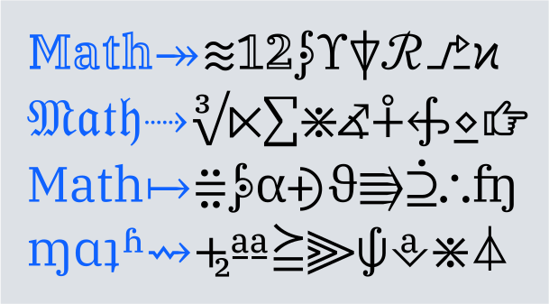
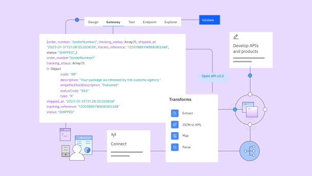
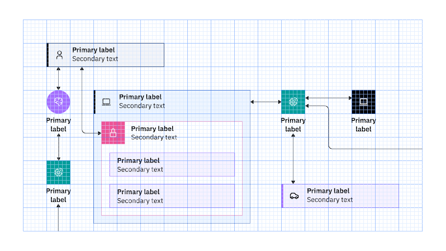
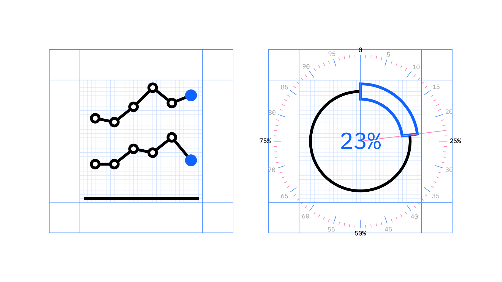

import { PageDescription, AnchorLinks, AnchorLink } from 'gatsby-theme-carbon';
import { gridImages } from '../../styles/Grid.module.scss';

<PageDescription>

The IBM Design Language guidance, assets, and site experience are constantly
evolving and improving. This page lists all major updates, changes, rollouts and
release dates. Check back here to learn what’s new in the latest release.

</PageDescription>

## IBM Plex Math

<Row className={gridImages}>
<Column colLg={8} colMd={6}>

</Column>
</Row>

After a year of anticipation, we’re excited to introduce IBM Plex® Math. This highly anticipated release includes over 5,000 new glyphs, covering a wide range of mathematical symbols, such as alphanumeric, double-struck, Fraktur, operators and script, as well as icons, arrows, Greek letters, phonetics, and technical and geometric shapes, making it one of the most complete math fonts available today. IBM Plex Math is a game-changer, providing a fresh and comprehensive alternative to STIX fonts and Microsoft’s Cambria Math. Its compatibility with IBM Plex® Serif Regular makes it an ideal choice for IBM researchers and mathematicians. You can find more information about the Plex® typeface family in the [IBM Design Language](/typography/typeface#ibm-plex-math) site and download IBM Plex Math from [GitHub](https://github.com/IBM/plex/releases). —  18 September 2024

## IBM Plex Sans Chinese

<Row className={gridImages}>
<Column colLg={8} colMd={6}>

</Column>
</Row>

After more than two years of design and development, IBM Plex® Sans Chinese TC (Traditional) is now available. This release will soon be followed by a IBM Plex® Chinese SC (Simplified) version, making Plex® Chinese a valuable landmark for our users. The Plex typeface family is open source and free to use. Additionally, the Plex typeface is available in Arabic, Cyrillic, Devanagari, Greek, Hebrew, Japanese, Korean and Thai. You can find more information about the Plex typeface family in the [IBM Design Language](/typography/typeface#language-support) site and download IBM Plex Sans TC from [GitHub](https://github.com/IBM/plex/releases). —  18 September 2024

## Hybrid UI illustration style

<Row className={gridImages}>
<Column colLg={8} colMd={6}>

</Column>
</Row>

Hybrid UI illustrations are the offspring of user interface design and conceptual illustration. They inherit visual qualities from both, making them a great fit for marketing hardware and software products, offerings and services. They feel at home on the same page with product screenshots and illustrations of abstract concepts alike. This versatile style can be used in many ways, for example, to depict complex or abstract ideas, outline relationships, convey workflows and more. These approachable illustrations help explain complicated scenarios and technical concepts about products in a simple and clear way. Find guidance and download the hybrid UI illustration kit on the IBM Design Language Illustration page for [Hybrid UI style](https://www.ibm.com/design/language/illustration/hybrid-ui-style/design). —  10 April, 2024

## Technical diagrams

<Row className={gridImages}>
<Column colLg={8} colMd={6}>

</Column>
</Row>

Technical diagrams are used throughout IBM. Their thoughtful arrangement, using a wide variety of elements, helps us deliver information with clarity. Based on the IBM Design Language and Carbon Design System, our technical diagrams might describe an IT architecture, show a structural hierarchy or outline the order of a process flow. Beyond the fundamentals for all technical diagrams, the IT architecture subsystem is dedicated to the vizualization of the IBM Unified Method Framework for IT architecture concepts. The product documentation subsystem covers flows, process diagrams and so on. You'll find useful, clear and descriptive guidance for [Design](https://www.ibm.com/design/language/infographics/technical-diagrams/design/) and [Usage](https://www.ibm.com/design/language/infographics/technical-diagrams/usage) on our new Technical diagrams pages. —  15 June, 2022

## Infograms

<Row className={gridImages}>
<Column colLg={8} colMd={6}>

</Column>
</Row>

Infograms are information graphics that mimic the style of IBM pictograms. But unlike the charts found in the IBM pictogram library that illustrate the idea of data visualization, infograms depict real data. Adapted for use in small spaces, the infogram works well as tertiary or marginal data. Stylistically, the infogram pairs with productive pictograms in visual harmony. Discover more about the six types of infograms and how each one provides instant visual comprehension of the data represented on the [Infograms](https://www.ibm.com/design/language/infographics/infograms) page. —  15 June, 2022

## People illustration

<Row className={gridImages}>
<Column colLg={8} colMd={6}>

<GifPlayer className="video-player" color="dark">

<Video autoPlay autoStart playsInline loop="on" muted src="./videos/PeoplePage_Announcement_Final_v1.mp4" />

</GifPlayer>
</Column>
</Row>

Humanity is integral to our work. It fosters insights we use to bring people and technologies together that create outcomes larger than we could ever accomplish alone. We celebrate humanity's vast diversity—of personalities, cultures and abilities—through inclusive illustration guidance that features an established aesthetic that’s identifiably IBM. Check out our [People](/illustration/people) page, where you'll find a distinct color palette for representing skin tones, precise geometry for realistic proportions, useful tips for creating portraits and more. —  25 May, 2022

## IBM Plex® Sans Japanese

<Row className={gridImages}>
<Column colLg={8} colMd={6}>

</Column>
</Row>

After two years of design and development, our custom-designed typeface, IBM Plex®, is now available in Japanese. IBM Plex Sans JP makes a fine addition to our non-Latin families and will continue to make IBM communications distinctive across all experiences in over 100 languages worldwide. Open source and free to use, Plex® also comes in Arabic, Cyrillic, Devanagari, Greek, Hebrew, Korean, and Thai. Learn more on how to [use the Plex typeface family](https://www.ibm.com/design/language/typography/typeface) and download [IBM Plex Sans JP](https://github.com/IBM/plex/releases) here. —  30 July, 2021
