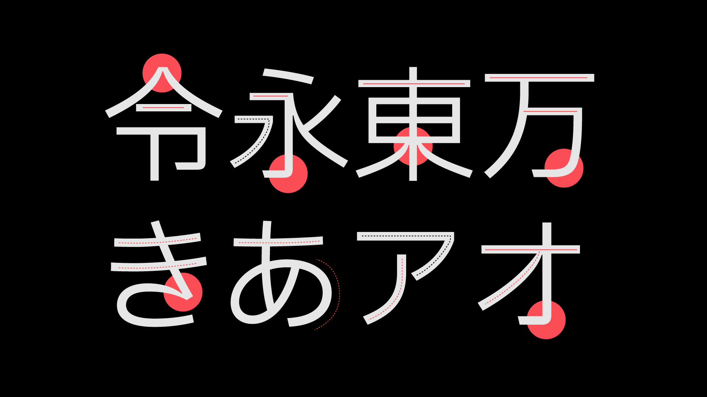

import { PageDescription, AnchorLinks, AnchorLink } from 'gatsby-theme-carbon';
import { gridImages } from '../../styles/Grid.module.scss';

<PageDescription>

The IBM Design Language guidance, assets, and site experience are constantly
evolving and improving. This page lists all major updates, changes, rollouts and
release dates. Check back here to learn what’s new in the latest release.

</PageDescription>

## People illustration

<Row className={gridImages}>
<Column colLg={8} colMd={6}>

<GifPlayer className="video-player" color="dark">

<Video autoPlay playsInline loop="on" muted src="./videos/PeoplePage_Announcement_Final_v1.mp4" />

</GifPlayer>

</Column>
</Row>

Humanity is integral to our work. It fosters insights we use to bring people and technologies together that create outcomes larger than we could ever accomplish alone. We celebrate humanity's vast diversity—of personalities, cultures and abilities—through inclusive illustration guidance that features an established aesthetic that’s identifiably IBM. Check out our [People](/illustration/people) page, where you'll find a distinct color palette for representing skin tones, precise geometry for realistic proportions, useful tips for creating portraits and more. —  20 May, 2022

## IBM Plex® Sans Japanese

<Row className={gridImages}>
<Column colLg={8} colMd={6}>

</Column>
</Row>

After two years of design and development, our custom-designed typeface, IBM Plex®, is now available in Japanese. IBM Plex Sans JP makes a fine addition to our non-Latin families and will continue to make IBM communications distinctive across all experiences in over 100 languages worldwide. Open source and free to use, Plex® also comes in Arabic, Cyrillic, Devanagari, Greek, Hebrew, Korean, and Thai. Learn more on how to [use the Plex typeface family](https://w3.ibm.com/w3publisher/ibm-plex-japanese) (w3id required) and download [IBM Plex Sans JP](https://github.com/IBM/plex/releases/tag/v5.2.1) here. —  30 July, 2021
