<PageDescription>

IBM imagery is a direct reflection of the way we see the world around us and
ourselves in it.

</PageDescription>

## Point-of-view

What makes an IBM image an IBM image? It’s subjective. But, if we are to Guide, as our design philosophy suggests, the photography we use gives us the opportunity to present ourselves as great observers of the working world and to show and tell stories. Our photography should set the scene or create context for the transformational conversations we want to have. It should demonstrate our interest in the world around us, and the positive effects we’re working to deliver as IBMers.

Everything communicates, and our use of imagery is no exception. The care and craft we put into our imagery choices demonstrates our commitment to best-in-class communication and a celebration of the work we do.

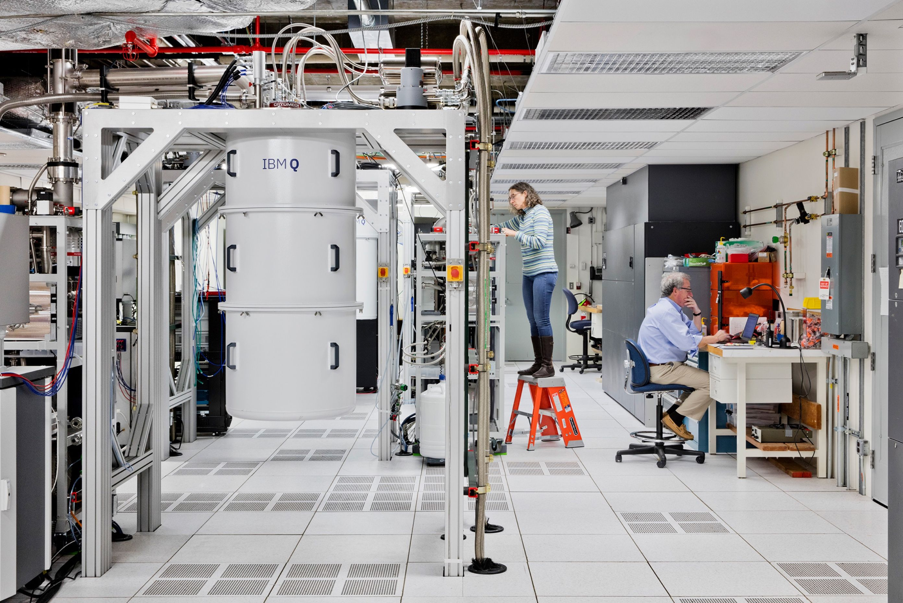

<Row className="gallery-row-padding">
<Column colMd={2} colLg={4}>

</Column>
<Column colMd={2} colLg={4}>

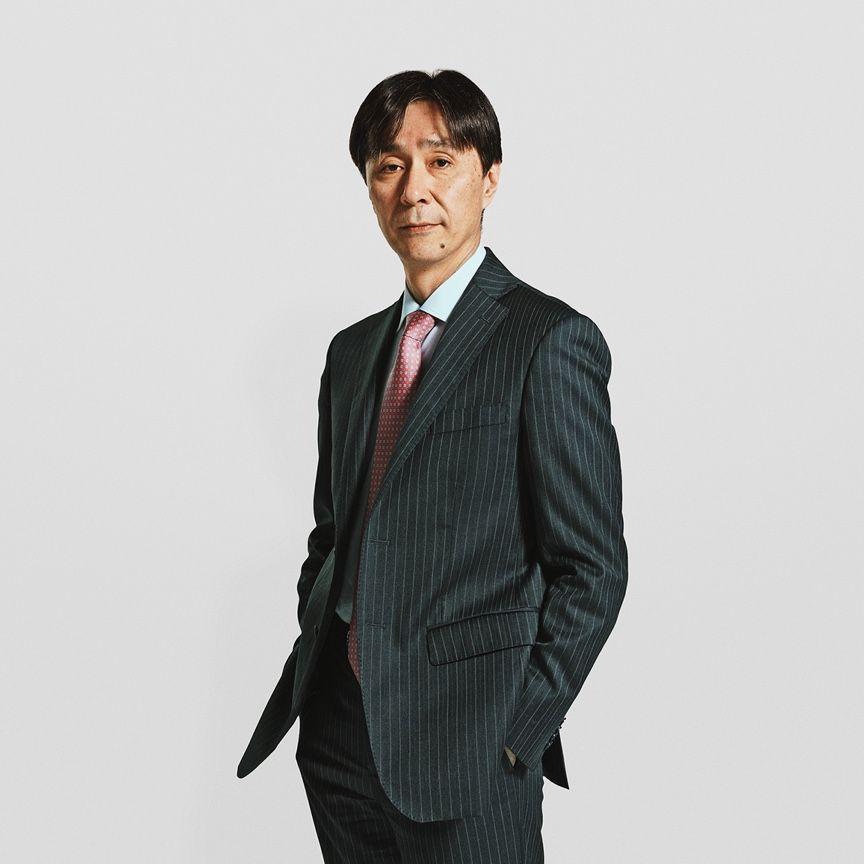

</Column>
</Row>

<Row className="gallery-row-padding">
<Column colMd={4} colLg={8} offsetMd={2} offsetLg={4}>

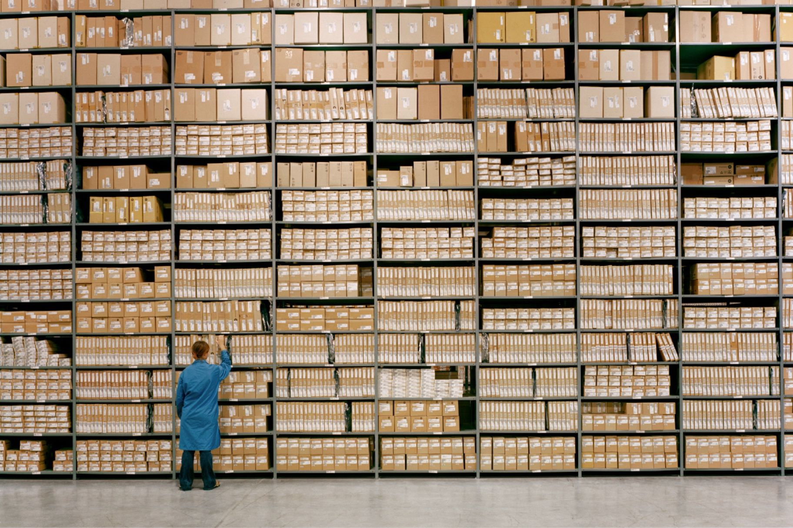

</Column>
</Row>

<Row className="gallery-row-padding">
<Column colMd={4} colLg={8}>

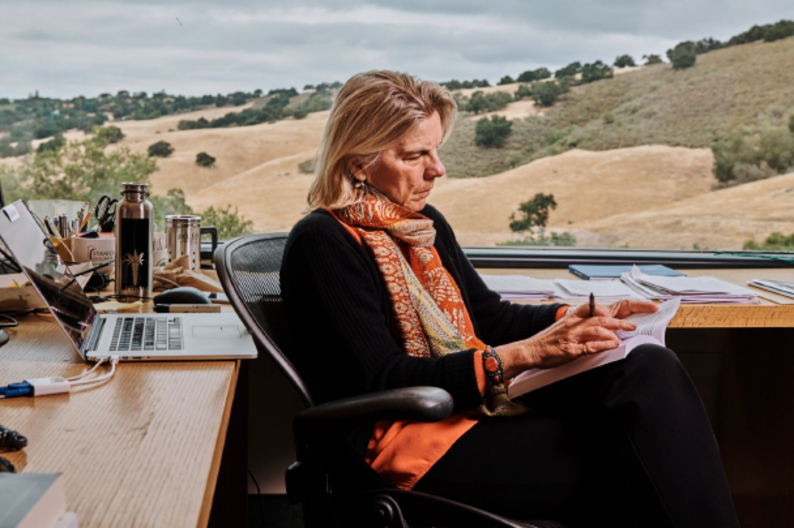

</Column>
<Column colMd={2} colLg={4}>

</Column>
</Row>

## Photo types

Given our scale and scope, no single photographic style can capture the variety of subjects or themes we need to convey. Different types of images are better suited for certain situations and subject matter. We’ve developed a definitive perspective on the types of imagery that best define IBM in both style and substance.

### **Reportage:** Working world

The bulk of the photography we use is lifestyle, cinematic and colorful. This is intentional. Every day, our work exposes us to different businesses, cultures, geographies, economies, fields and industries. In return, this exposure informs us and inspires our thinking. We proudly present the world as it is. Our approach is editorial, like documentary filmmaking or journalism. The result are images that feel like frames from a film, active and moving in their portrayal of our role in society. We are progressive participants.

<Row className="gallery-row-padding">

<Column colMd={3} colLg={4}>

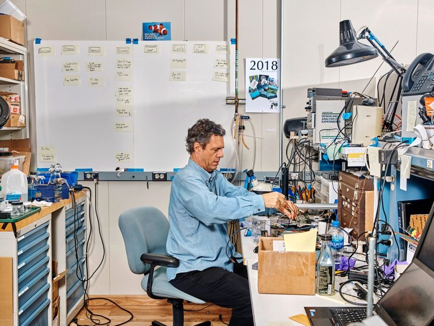

</Column>
<Column colMd={3} colLg={4}>

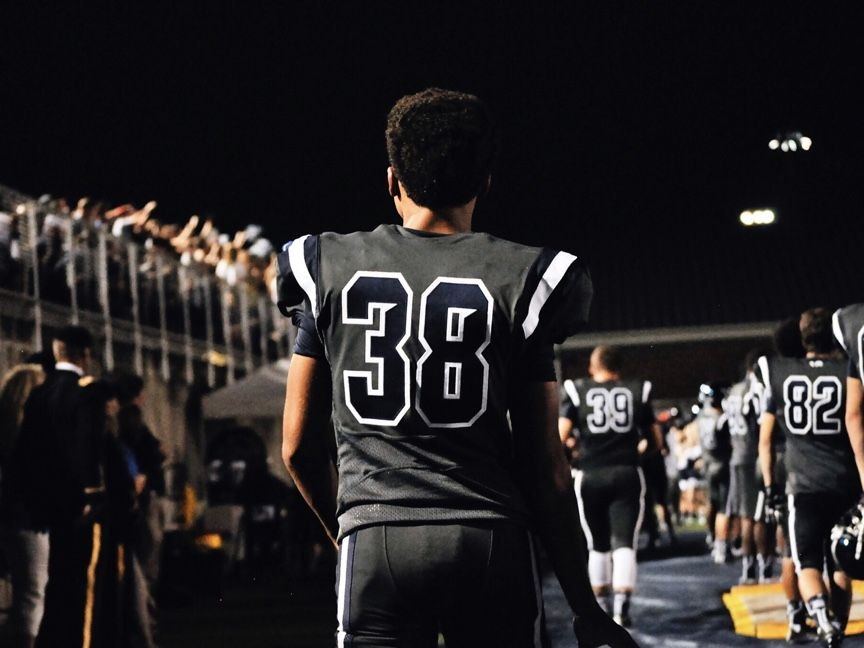

</Column>

</Row>
<Row className="gallery-row-padding">

<Column colMd={2} colLg={3}>

</Column>
<Column colMd={4} colLg={5}>

</Column>

</Row>

### **Portraiture:** Progress partners

Professionals are to IBM what athletes are to Nike. We champion professionals. Portraiture allows us to isolate individual IBMers, clients and/or teams, to capture their character, and focus on the unique personalities and perspectives they provide. Our approach is democratic. We never invest more (or less) photographically based stature or status, but rather with equal skill and high standards. This is another demonstration (statement) of our emphasis on forward-thinkers.

<Row className="gallery-row-padding">

<Column colMd={2} colLg={3}>

</Column>
<Column colMd={4} colLg={5}>

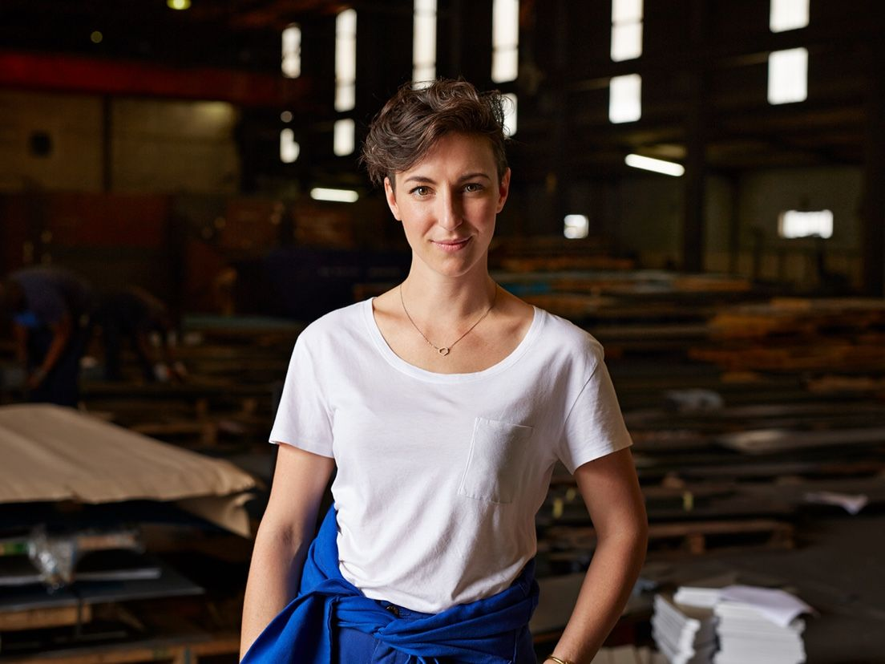

</Column>

</Row>
<Row className="gallery-row-padding">

<Column colMd={4} colLg={5}>

</Column>
<Column colMd={2} colLg={3}>

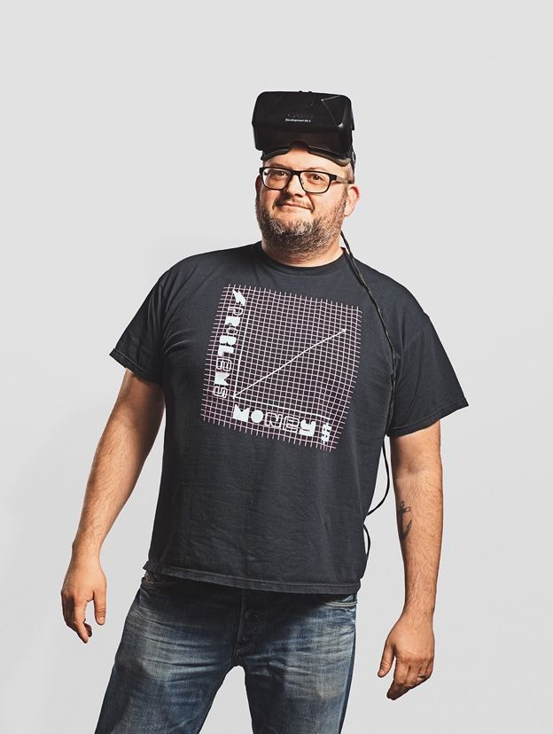

</Column>

</Row>

### **Still-life:** Exhibiting excellence

Great imagery is both an art and a science, equal parts expression and engineering. Still life photography is best suited for celebrating the beauty and creativity of things, showing how things work, conveying concepts, and displaying details. We always try to objectify the idea or object so that it can be appreciated for its authenticity. This approach is primarily used when presenting hardware or software products, but can also be a creative way to convey concepts that aren’t easily rendered in real life.

<Row className="gallery-row-padding">

<Column colMd={3} colLg={4}>

</Column>
<Column colMd={3} colLg={4}>

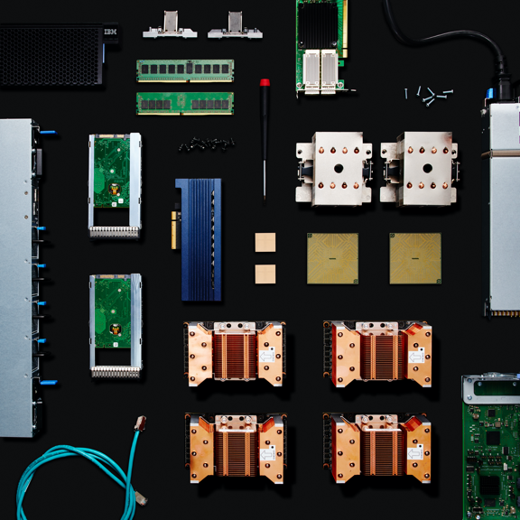

</Column>

</Row>
<Row className="gallery-row-padding">

<Column colMd={4} colLg={5}>

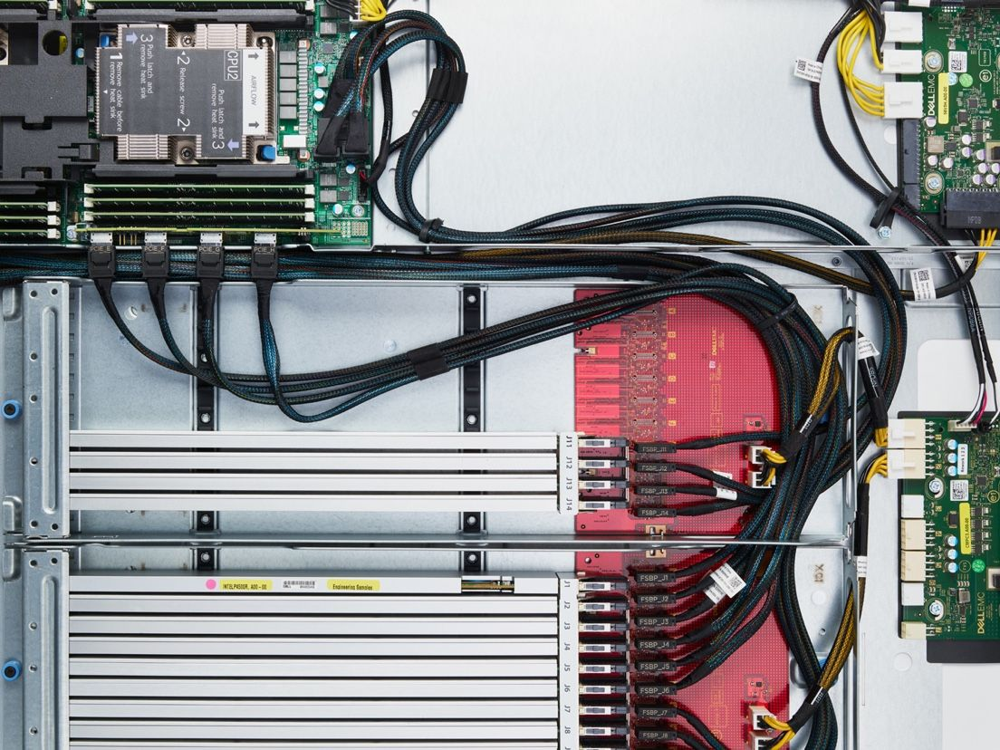

</Column>
<Column colMd={2} colLg={3}>

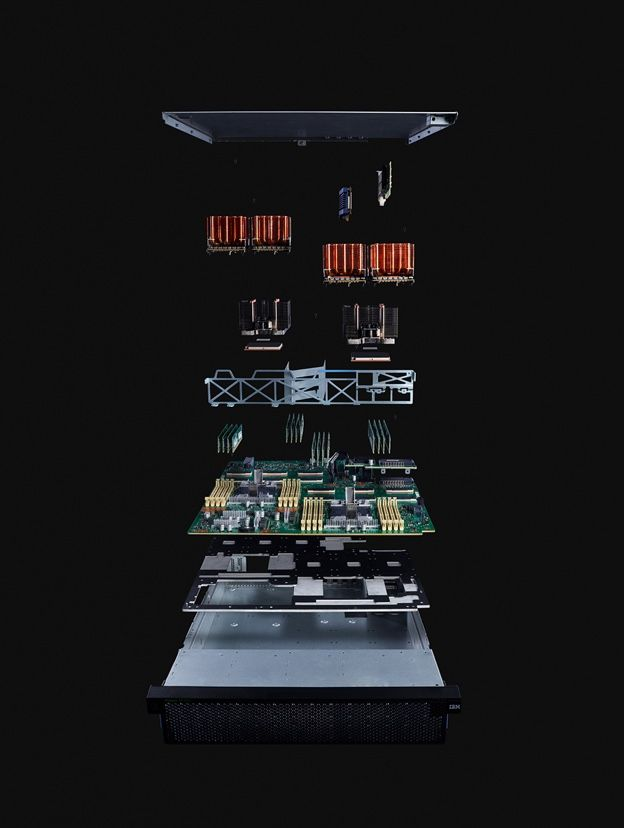

</Column>

</Row>
